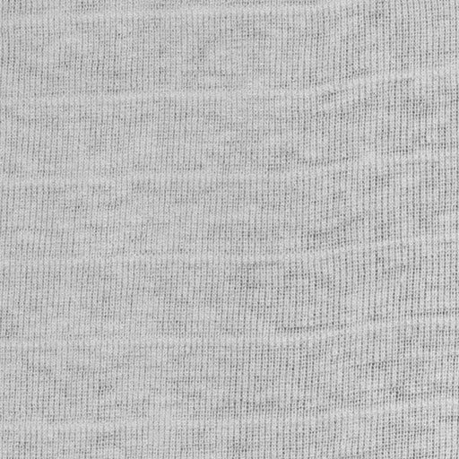
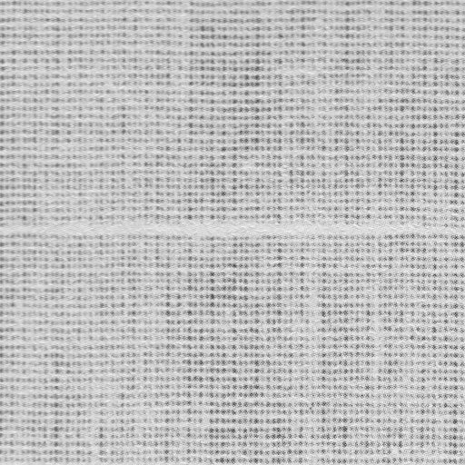
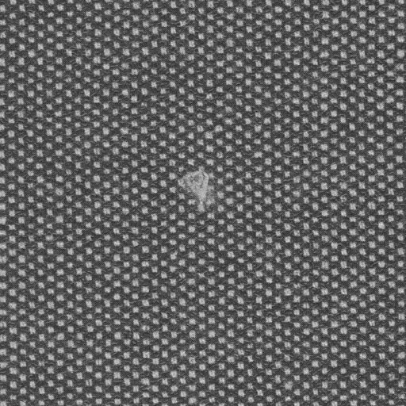
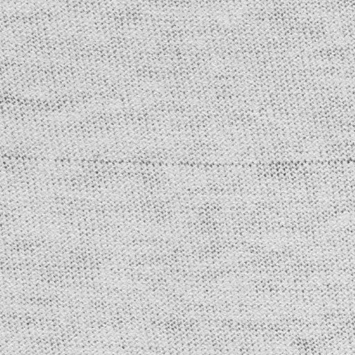
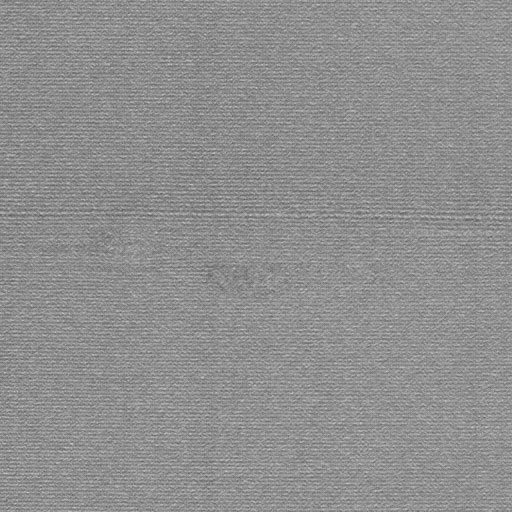

```python
import numpy as np
from IPython.display import display
from PIL import Image, ImageDraw
import random as rn
rn.seed(2607)
```


```python
np.array(rn.sample(range(2, 197), 100))

```


    array([ 52, 172, 159,   6,  51, 129, 127, 116,  29, 191,  59,  90, 141,
            42,  48, 114,  37,  68,  89, 152,  63, 173,  35, 166, 153, 151,
           164, 128,   4, 163,  92,  18,  13,  22, 189, 194,  33,  99,  11,
            81,  58,  30, 115, 103,  45, 169, 100,   9,  49,  72,  36, 104,
            47,  96, 185, 161, 140,  91, 137, 193,  60, 170,  64, 188, 150,
           171, 135,  93, 192,  88, 125, 122,  17,   2,  65, 119,   7,  27,
            14,  67,  43, 107, 145,  71,  20, 175,  41,  16, 143, 179, 196,
           187, 101,  31, 190,  87,  26,  55, 112,  19])


image 1: 172, image 2: 6, image 3: 116, image 4: 191, image 5: 59


```python
image_names= ["0172.jpg","0006.jpg","0116.jpg","0191.jpg","0059.jpg"]
```


```python
for name in image_names:
    # Load the image
    image_path = "rawimage/"+name
    color_image = Image.open(image_path)


    # Convert the image to grayscale
    gray_image = color_image.convert("L")
    gray_image_array=np.array(gray_image)


    # Save the grayscale image
    gray_image_path = "grayimages/"+name
    gray_image.save(gray_image_path)
    display(gray_image)

```


    

    


    

    


    

    


    

    


    

    

