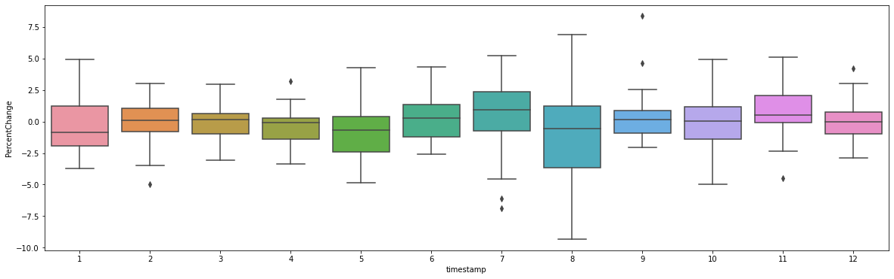

# Project Part One
[Click Here](index.md) to return Index page.

## Index 
1. Importing Libraries
2. Loading the Dataset and Data Preprocessing
3. Feature Engineering
4. Calculating IQR and Finding Outliers
5. Conclusions and Google Trends Analysis

**1. Importing Libraries**


```python
import pandas as pd
import numpy as np
from datetime import timedelta
from datetime import datetime
import seaborn as sb
import matplotlib.pyplot as plt
```

**2. Loading the Dataset and Data Preprocessing**


```python
df = pd.read_csv("data/all_ticks_long.csv")
```

2.1 Displaying Unique Stock Names


```python
df["short_name"].unique()
```


    array(['AEFES', 'AKBNK', 'AKSA', 'AKSEN', 'ALARK', 'ALBRK', 'ANACM',
           'ARCLK', 'ASELS', 'ASUZU', 'AYGAZ', 'BAGFS', 'BANVT', 'BRISA',
           'CCOLA', 'CEMAS', 'ECILC', 'EREGL', 'FROTO', 'GARAN', 'GOODY',
           'GUBRF', 'HALKB', 'ICBCT', 'ISCTR', 'ISDMR', 'ISFIN', 'ISYAT',
           'KAREL', 'KARSN', 'KCHOL', 'KRDMB', 'KRDMD', 'MGROS', 'OTKAR',
           'PARSN', 'PETKM', 'PGSUS', 'PRKME', 'SAHOL', 'SASA', 'SISE',
           'SKBNK', 'SODA', 'TCELL', 'THYAO', 'TKFEN', 'TOASO', 'TRKCM',
           'TSKB', 'TTKOM', 'TUKAS', 'TUPRS', 'USAK', 'VAKBN', 'VESTL',
           'YATAS', 'YKBNK', 'YUNSA', 'ZOREN'], dtype=object)


2.2 Choosing a stock to analyze. In this case, **'TCELL'** is selected.


```python
stock="TCELL"
stock_df=df[df["short_name"] ==stock]
```

2.3 Converting dates to Datetime object.


```python
stock_df['timestamp'] = pd.to_datetime(stock_df['timestamp'])
stock_df = stock_df.set_index(stock_df['timestamp'])
```


2.4 Defining Date limits and filtering data. A two-year period of time is chosen.


```python
lwr_limit_date = "2017-01-01" 
middle_limit_date = "2018-01-01"
uppr_limit_date ="2019-01-01"
stock_df = stock_df[stock_df.index > lwr_limit_date ]
stock_df = stock_df[stock_df.index < uppr_limit_date]
```

2.5 Resample the data to daily frequency, taking the last price each day. Drop NA data.


```python
day_stock_df=stock_df["price"].groupby(pd.Grouper(freq="1440min")).last().rename("Close").to_frame()
day_stock_df.dropna(inplace=True)
day_stock_df = day_stock_df[day_stock_df.index.weekday < 5]
```

**3. Feature Engineering**

3.1.1 Create a lagged version of the close price for further analysis

3.1.2 Calculate the variance of the price for each day

3.1.3 Normalize the variance to have it on a scale from 0 to 1


```python
day_stock_df["LagClose"]=day_stock_df["Close"].shift(1) #3.1.1
day_stock_df["Var"]=stock_df["price"].groupby(pd.Grouper(freq="1440min")).var() #3.1.2
day_stock_df["NormVar"]=(day_stock_df['Var'] - day_stock_df['Var'].min()) / (day_stock_df['Var'].max() - day_stock_df['Var'].min()) #3.1.3 
day_stock_df.dropna(inplace=True)
```

3.2 Calculate the percentage change in price from the previous day


```python
day_stock_df["PercentChange"]=(day_stock_df["Close"]-day_stock_df["LagClose"])/day_stock_df["LagClose"]*100
```

3.3 Extract Month and Year from the index for grouping purposes


```python
day_stock_df["Date"]=day_stock_df.index
day_stock_df["Month"]=day_stock_df["Date"].apply(lambda x: x.month)
day_stock_df["Year"]=day_stock_df["Date"].apply(lambda x: x.year)
day_stock_df.drop(columns=["Date"],inplace=True)
```

3.3.1 Display data for a specific date range


```python
day_stock_df.loc["2018-09-10":"2018-09-20"]
```


<div>
<style scoped>
    .dataframe tbody tr th:only-of-type {
        vertical-align: middle;
    }

    .dataframe tbody tr th {
        vertical-align: top;
    }

    .dataframe thead th {
        text-align: right;
    }
</style>
<table border="1" class="dataframe">
  <thead>
    <tr style="text-align: right;">
      <th></th>
      <th>Close</th>
      <th>LagClose</th>
      <th>Var</th>
      <th>NormVar</th>
      <th>PercentChange</th>
      <th>Month</th>
      <th>Year</th>
    </tr>
    <tr>
      <th>timestamp</th>
      <th></th>
      <th></th>
      <th></th>
      <th></th>
      <th></th>
      <th></th>
      <th></th>
    </tr>
  </thead>
  <tbody>
    <tr>
      <th>2018-09-10 00:00:00+00:00</th>
      <td>10.2578</td>
      <td>10.2578</td>
      <td>0.003854</td>
      <td>0.036385</td>
      <td>0.000000</td>
      <td>9</td>
      <td>2018</td>
    </tr>
    <tr>
      <th>2018-09-11 00:00:00+00:00</th>
      <td>10.1151</td>
      <td>10.2578</td>
      <td>0.004317</td>
      <td>0.040916</td>
      <td>-1.391137</td>
      <td>9</td>
      <td>2018</td>
    </tr>
    <tr>
      <th>2018-09-12 00:00:00+00:00</th>
      <td>9.9058</td>
      <td>10.1151</td>
      <td>0.008350</td>
      <td>0.080402</td>
      <td>-2.069184</td>
      <td>9</td>
      <td>2018</td>
    </tr>
    <tr>
      <th>2018-09-13 00:00:00+00:00</th>
      <td>10.7337</td>
      <td>9.9058</td>
      <td>0.068359</td>
      <td>0.667887</td>
      <td>8.357730</td>
      <td>9</td>
      <td>2018</td>
    </tr>
    <tr>
      <th>2018-09-14 00:00:00+00:00</th>
      <td>10.6575</td>
      <td>10.7337</td>
      <td>0.014639</td>
      <td>0.141972</td>
      <td>-0.709914</td>
      <td>9</td>
      <td>2018</td>
    </tr>
    <tr>
      <th>2018-09-17 00:00:00+00:00</th>
      <td>10.9094</td>
      <td>10.6575</td>
      <td>0.010015</td>
      <td>0.096705</td>
      <td>2.363594</td>
      <td>9</td>
      <td>2018</td>
    </tr>
    <tr>
      <th>2018-09-18 00:00:00+00:00</th>
      <td>10.9582</td>
      <td>10.9094</td>
      <td>0.001586</td>
      <td>0.014178</td>
      <td>0.447321</td>
      <td>9</td>
      <td>2018</td>
    </tr>
    <tr>
      <th>2018-09-19 00:00:00+00:00</th>
      <td>10.8605</td>
      <td>10.9582</td>
      <td>0.011680</td>
      <td>0.112998</td>
      <td>-0.891570</td>
      <td>9</td>
      <td>2018</td>
    </tr>
    <tr>
      <th>2018-09-20 00:00:00+00:00</th>
      <td>11.1340</td>
      <td>10.8605</td>
      <td>0.003561</td>
      <td>0.033513</td>
      <td>2.518300</td>
      <td>9</td>
      <td>2018</td>
    </tr>
  </tbody>
</table>
</div>


```python
plt.scatter(day_stock_df.index,day_stock_df["PercentChange"])
```


    <matplotlib.collections.PathCollection at 0x7fd6f003d490>


    

    


3.4 Split the data into two different dataframes based on the defined limit date


```python
first_year=day_stock_df[day_stock_df.index<middle_limit_date]
second_year=day_stock_df[day_stock_df.index>middle_limit_date]
```

3.5.1 Create a boxplot of the percentage change for each month of the first year


```python
plt.figure(figsize=(20, 6))
sb.boxplot(y=first_year["PercentChange"],x=first_year.index.month)
```


    <AxesSubplot:xlabel='timestamp', ylabel='PercentChange'>


    

    


3.5.2 Create a boxplot of the percentage change for each month of the second year


```python
plt.figure(figsize=(20, 6))
sb.boxplot(y=second_year["PercentChange"],x=second_year.index.month)
```


    <AxesSubplot:xlabel='timestamp', ylabel='PercentChange'>


    

    


**4. Calculating IQR and Finding Outliers**

4.1 Define a function to find outliers in a dataset based on the IQR method


```python
def find_outliers(df,column="PercentChange"):
    Q1 = df[column].quantile(0.25)
    Q3 = df[column].quantile(0.75)
    IQR = Q3 - Q1
    lower_bound = Q1 - 1.5 * IQR
    upper_bound = Q3 + 1.5 * IQR

    outliers = df[(df[column] < lower_bound) | (df[column] > upper_bound)]
    return outliers
```

4.2 Loop through each year and month to find outliers


```python
flag=0
for year in day_stock_df["Year"].unique():
    df_year=day_stock_df[day_stock_df["Year"]== year]
    for month in day_stock_df["Month"].unique():
        df=df_year[df_year["Month"]==month]
        if flag==0:
            OC_outliers=find_outliers(df)
            flag=1
        else:
            monthly_outliers=find_outliers(df)
            OC_outliers=pd.concat([OC_outliers,monthly_outliers])
```

4.3  Similar loop to find outliers within a 15-day period before and after each month, This is done because IQR Technique may label trend data as Outlier. 


```python
flag=0
for year in day_stock_df["Year"].unique():
    df_year=day_stock_df[day_stock_df["Year"]== year]
    for month in day_stock_df["Month"].unique():
        if month==1:
            start_date = str(year-1)+"-"+str(12)+"-15"
            end_date = str(year)+"-"+str(month)+"-15"
        else:
            start_date = str(year)+"-"+str(month-1)+"-15"
            end_date = str(year)+"-"+str(month)+"-15"
        df=df_year.loc[start_date:end_date]
        if flag==0:
            OC_outliers15=find_outliers(df)
            flag=1
        else:
            monthly_outliers=find_outliers(df)
            OC_outliers15=pd.concat([OC_outliers15,monthly_outliers])
```

4.4  Find the common indices between the two outlier dataframes


```python
common_indexes = OC_outliers.index.intersection(OC_outliers15.index)
```

4.5 Get the outliers that are common in both periods


```python
outliers=OC_outliers.loc[common_indexes]
```


```python
outliers
```


<div>
<style scoped>
    .dataframe tbody tr th:only-of-type {
        vertical-align: middle;
    }

    .dataframe tbody tr th {
        vertical-align: top;
    }

    .dataframe thead th {
        text-align: right;
    }
</style>
<table border="1" class="dataframe">
  <thead>
    <tr style="text-align: right;">
      <th></th>
      <th>Close</th>
      <th>LagClose</th>
      <th>Var</th>
      <th>NormVar</th>
      <th>PercentChange</th>
      <th>Month</th>
      <th>Year</th>
    </tr>
    <tr>
      <th>timestamp</th>
      <th></th>
      <th></th>
      <th></th>
      <th></th>
      <th></th>
      <th></th>
      <th></th>
    </tr>
  </thead>
  <tbody>
    <tr>
      <th>2017-04-20 00:00:00+00:00</th>
      <td>10.1600</td>
      <td>9.9259</td>
      <td>0.004446</td>
      <td>0.042182</td>
      <td>2.358476</td>
      <td>4</td>
      <td>2017</td>
    </tr>
    <tr>
      <th>2017-05-04 00:00:00+00:00</th>
      <td>9.5162</td>
      <td>10.2687</td>
      <td>0.001431</td>
      <td>0.012664</td>
      <td>-7.328094</td>
      <td>5</td>
      <td>2017</td>
    </tr>
    <tr>
      <th>2017-07-07 00:00:00+00:00</th>
      <td>10.0893</td>
      <td>10.2457</td>
      <td>0.001078</td>
      <td>0.009207</td>
      <td>-1.526494</td>
      <td>7</td>
      <td>2017</td>
    </tr>
    <tr>
      <th>2017-11-01 00:00:00+00:00</th>
      <td>13.4303</td>
      <td>12.7637</td>
      <td>0.040955</td>
      <td>0.399601</td>
      <td>5.222624</td>
      <td>11</td>
      <td>2017</td>
    </tr>
    <tr>
      <th>2017-11-02 00:00:00+00:00</th>
      <td>12.7997</td>
      <td>13.4303</td>
      <td>0.102282</td>
      <td>1.000000</td>
      <td>-4.695353</td>
      <td>11</td>
      <td>2017</td>
    </tr>
    <tr>
      <th>2018-02-20 00:00:00+00:00</th>
      <td>13.5576</td>
      <td>14.2629</td>
      <td>0.041883</td>
      <td>0.408686</td>
      <td>-4.944997</td>
      <td>2</td>
      <td>2018</td>
    </tr>
    <tr>
      <th>2018-07-10 00:00:00+00:00</th>
      <td>11.5234</td>
      <td>12.2751</td>
      <td>0.046620</td>
      <td>0.455062</td>
      <td>-6.123779</td>
      <td>7</td>
      <td>2018</td>
    </tr>
    <tr>
      <th>2018-07-11 00:00:00+00:00</th>
      <td>10.7337</td>
      <td>11.5234</td>
      <td>0.031914</td>
      <td>0.311088</td>
      <td>-6.853012</td>
      <td>7</td>
      <td>2018</td>
    </tr>
    <tr>
      <th>2018-09-07 00:00:00+00:00</th>
      <td>10.2578</td>
      <td>9.8012</td>
      <td>0.015909</td>
      <td>0.154403</td>
      <td>4.658613</td>
      <td>9</td>
      <td>2018</td>
    </tr>
    <tr>
      <th>2018-09-13 00:00:00+00:00</th>
      <td>10.7337</td>
      <td>9.9058</td>
      <td>0.068359</td>
      <td>0.667887</td>
      <td>8.357730</td>
      <td>9</td>
      <td>2018</td>
    </tr>
  </tbody>
</table>
</div>


**This is done for only one Stock. We defined a function to speed up the process for 5 remaining stocks.**


```python
def easy_to_run(data,stock):
    df =data
    stock_df= df[df["short_name"] ==stock]
    stock_df['timestamp'] = pd.to_datetime(stock_df['timestamp'])
    stock_df = stock_df.set_index(stock_df['timestamp'])
    lwr_limit_date = "2017-01-01" 
    middle_limit_date = "2018-01-01"
    uppr_limit_date ="2019-01-01"
    stock_df = stock_df[stock_df.index > lwr_limit_date ]
    stock_df = stock_df[stock_df.index < uppr_limit_date]
    day_stock_df=stock_df["price"].groupby(pd.Grouper(freq="1440min")).last().rename("Close").to_frame()
    day_stock_df.dropna(inplace=True)
    day_stock_df = day_stock_df[day_stock_df.index.weekday < 5]
    day_stock_df["LagClose"]=day_stock_df["Close"].shift(1) # Create a lagged version of the close price for further analysis
    day_stock_df["Var"]=stock_df["price"].groupby(pd.Grouper(freq="1440min")).var() # Calculate the variance of the price for each day
    day_stock_df["NormVar"]=(day_stock_df['Var'] - day_stock_df['Var'].min()) / (day_stock_df['Var'].max() - day_stock_df['Var'].min()) # Normalize the variance to have it on a scale from 0 to 1
    day_stock_df.dropna(inplace=True)
    day_stock_df["PercentChange"]=(day_stock_df["Close"]-day_stock_df["LagClose"])/day_stock_df["LagClose"]*100
    day_stock_df["Date"]=day_stock_df.index
    day_stock_df["Month"]=day_stock_df["Date"].apply(lambda x: x.month)
    day_stock_df["Year"]=day_stock_df["Date"].apply(lambda x: x.year)
    day_stock_df.drop(columns=["Date"],inplace=True)
    first_year=day_stock_df[day_stock_df.index<middle_limit_date]
    second_year=day_stock_df[day_stock_df.index>middle_limit_date]
    flag=0
    for year in day_stock_df["Year"].unique():
        df_year=day_stock_df[day_stock_df["Year"]== year]
        for month in day_stock_df["Month"].unique():
            df=df_year[df_year["Month"]==month]
            if flag==0:
                OC_outliers=find_outliers(df)
                flag=1
            else:
                monthly_outliers=find_outliers(df)
                OC_outliers=pd.concat([OC_outliers,monthly_outliers])
    flag=0
    for year in day_stock_df["Year"].unique():
        df_year=day_stock_df[day_stock_df["Year"]== year]
        for month in day_stock_df["Month"].unique():
            if month==1:
                start_date = str(year-1)+"-"+str(12)+"-15"
                end_date = str(year)+"-"+str(month)+"-15"
            else:
                start_date = str(year)+"-"+str(month-1)+"-15"
                end_date = str(year)+"-"+str(month)+"-15"
            df=df_year.loc[start_date:end_date]
            if flag==0:
                OC_outliers15=find_outliers(df)
                flag=1
            else:
                monthly_outliers=find_outliers(df)
                OC_outliers15=pd.concat([OC_outliers15,monthly_outliers])
    common_indexs = OC_outliers.index.intersection(OC_outliers15.index)
    outliers=OC_outliers.loc[common_indexs]
    appr_two_dates = outliers.index.unique()
    return appr_two_dates
```


```python
data = pd.read_csv("all_ticks_long.csv")
stock_set = ["THYAO","PGSUS", "TTKOM","TCELL","GARAN","AKBNK"]
all_dates = []
for i in stock_set:
    all_dates.append([i, easy_to_run(data, i)])
```


```python
all_dates
```


    [['THYAO',
      DatetimeIndex(['2017-03-01 00:00:00+00:00', '2017-03-21 00:00:00+00:00',
                     '2017-03-22 00:00:00+00:00', '2017-08-14 00:00:00+00:00',
                     '2017-10-09 00:00:00+00:00', '2018-01-10 00:00:00+00:00',
                     '2018-01-15 00:00:00+00:00', '2018-03-06 00:00:00+00:00',
                     '2018-06-08 00:00:00+00:00', '2018-08-15 00:00:00+00:00'],
                    dtype='datetime64[ns, UTC]', name='timestamp', freq=None)],
     ['PGSUS',
      DatetimeIndex(['2017-03-20 00:00:00+00:00', '2017-04-17 00:00:00+00:00',
                     '2017-05-11 00:00:00+00:00', '2017-07-10 00:00:00+00:00',
                     '2018-05-25 00:00:00+00:00', '2018-07-11 00:00:00+00:00',
                     '2018-07-17 00:00:00+00:00', '2018-12-12 00:00:00+00:00'],
                    dtype='datetime64[ns, UTC]', name='timestamp', freq=None)],
     ['TTKOM',
      DatetimeIndex(['2017-01-12 00:00:00+00:00', '2017-04-26 00:00:00+00:00',
                     '2017-07-17 00:00:00+00:00', '2017-08-28 00:00:00+00:00',
                     '2017-11-30 00:00:00+00:00', '2018-01-23 00:00:00+00:00',
                     '2018-05-22 00:00:00+00:00', '2018-05-30 00:00:00+00:00',
                     '2018-06-01 00:00:00+00:00', '2018-07-11 00:00:00+00:00',
                     '2018-10-04 00:00:00+00:00', '2018-11-07 00:00:00+00:00'],
                    dtype='datetime64[ns, UTC]', name='timestamp', freq=None)],
     ['TCELL',
      DatetimeIndex(['2017-04-20 00:00:00+00:00', '2017-05-04 00:00:00+00:00',
                     '2017-07-07 00:00:00+00:00', '2017-11-01 00:00:00+00:00',
                     '2017-11-02 00:00:00+00:00', '2018-02-20 00:00:00+00:00',
                     '2018-07-10 00:00:00+00:00', '2018-07-11 00:00:00+00:00',
                     '2018-09-07 00:00:00+00:00', '2018-09-13 00:00:00+00:00'],
                    dtype='datetime64[ns, UTC]', name='timestamp', freq=None)],
     ['GARAN',
      DatetimeIndex(['2017-01-12 00:00:00+00:00', '2017-04-10 00:00:00+00:00',
                     '2017-07-11 00:00:00+00:00', '2018-02-15 00:00:00+00:00',
                     '2018-02-21 00:00:00+00:00', '2018-06-25 00:00:00+00:00',
                     '2018-07-10 00:00:00+00:00', '2018-07-11 00:00:00+00:00'],
                    dtype='datetime64[ns, UTC]', name='timestamp', freq=None)],
     ['AKBNK',
      DatetimeIndex(['2017-04-10 00:00:00+00:00', '2017-09-27 00:00:00+00:00',
                     '2018-07-10 00:00:00+00:00', '2018-07-11 00:00:00+00:00'],
                    dtype='datetime64[ns, UTC]', name='timestamp', freq=None)]]

**5. Conclusions and Google Trends Analysis**

<p>The six stocks selected for review in our project are as follows: from the aviation sector,
Turkish Airlines (THYAO) and Pegasus (PGSUS); from the telecommunications sector, Türk
Telekom (TTKOM) and Turkcell (TCELL); and from the banking sector, Garanti (GARAN) and
Akbank (AKBNK).

We executed our code to identify outliers within the data of these stocks, and then we
checked Google Trends to see if there was a peak in searches related to our stock on the
dates corresponding to the output.

Upon examining the Google Trends graphs for the months containing the relevant dates, we
observed that there were peak points on the dates with outliers. This observation has
reinforced our confidence in the accuracy of our approach to identifying outlier dates.</p>

### 1.THYAO ###

The outlier dates for **THYAO** turned out to be: _2017-03-01, 2017-03-21, 2017-03-22,
2017-08-14, 2017-10-09, 2018-01-10, 2018-01-15, 2018-03-06, 2018-06-08 and 2018-08-15_.


**21st and 22nd of May** were 2 of the outliers, and the search for IST:THYAO was the highest in
the month during those days. 


Similarly, In January 2018, the peak points occured mainly on the outlier points, which are
**10th and 15th**. 

### 2.PGSUS ###

The outlier dates for **PGSUS** turned out to be _2017-03-20, 2017-04-17,2017-05-11,
2017-07-10, 2018-05-25, 2018-07-11, 2018-07-17 and 2018-12-12_.


When we look at July 2018, our outlier dates **(11th and 17th)** were very popular when it
comes to the search: IST:PGSUS. 


Again, the search was very popular starting from 2 days prior to our outlier date **(April 17th)**
and unpopular after it. 

### 3.TTKOM ###

The outlier dates for **TTKOM** turned out to be _2017-01-12, 2017-04-26, 2017-07-
17, 2017-08-28, 2017-11-30, 2018-01-23, 2018-05-22, 2018-05-30, 2018-06-01, 2018-07-11,
2018-10-04, and 2018-11-07._


When we look at the Google trends data in **May 2018**, a peak occured starting from our
outlier date **(22nd)** and the topic remained hot until the beginning of **June**, which is after 2
another outlier dates **(30th of May and 1st of June)**


This trend data shows a peak started on our outlier date which is **26th** of April and then that
trend disappeared. Note that there are other peaks in the month and they are probably
caused by something other than stock market prices of Turk Telekom.

### 4.TCELL ###

The outlier dates for _TCELL_ turned out to be **2017-04-20, 2017-05-04, 2017-07-07,
2017-11-01, 2017-11-02, 2018-02-20, 2018-07-10, 2018-07-11, 2018-09-07, and 2018-09-13**.


When we look at **November 2017** google trends data, we can see that Turkcell stocks were
very popular in terms of search during outlier dates that we found, which are **1st and 2nd of
November**. 


When we look at the **September 2018** trend data, our outliers, which are **7th and 13th of
September**, were local maximums in terms of search trend. Therefore, we can say that there
is a correlation between the unusual stock price change and the trend. Note that the global
maximum fort his month is not an outlier date, so there must be another explanation about
it

### 5.GARAN ###

The outlier dates for **GARAN** turned out to be _2017-01-12, 2017-04-10, 2017-07-
11, 2018-02-15, 2018-02-21, 2018-06-25, 2018-07-10, and 2018-07-11_.


When we look at the trend data of **July 2018**, we can see that our outlier date (10th of June)
is the most popular search during those 2 weeks. We can be very confident about the
robustness of our code at this point, and the outlier-search trend correlation is very obvious.


When we look at the trend data of **January 2017, 12th of January**, which is an outlier date, is
the highest among all. This again shows strong correlation between the outlier data points
and search trend.

### 6.AKBNK ###

The outlier dates for **AKBNK** turned out to be _2017-04-10, 2017-09-27, 2018-07-10,
2018-07-11_


When we look at the Google trends data for AKBNK on **July 2018**, we can see that **10th of
July**, which is an outlier point of the stock data, ranks the top. This shows strong correlation
between the unstable stock prices and people’s search interests.


This data is the trend data for **April 2017**. As can be seen, 1 day after 10th of April, which is
an outlier, is the top trend in April. This indicates a strong correlation between search
keywords of search engines and real-world stock data.

<p>Sharp rises and falls in stock prices can create unusual data points, known as outliers. These
often have a clear cause. A single stock can change in price sharply if something big happens
in the company. Sometimes, the whole stock market might go up or down together. Or a
specific industry might see a general rise or drop. For example, both Turkcell and Türk
Telekom stocks show outliers on July 11, 2018, it suggests there was an important event on
that date affecting the telecom industry.</p>
