```python
import zipfile
import os
import glob
import pandas as pd
import matplotlib.pyplot as plt
import seaborn as sns
from sklearn.linear_model import LinearRegression
from datetime import datetime
import numpy as np
```

### **PROJECT PART TWO - TASK ONE**

**Step 1 - Extracting, Editing, Merging Files**


```python
zip_file_path = '20180101_20231121_bist30.zip'
extracted_dir = '423_extracted'
os.makedirs(extracted_dir, exist_ok=True)
with zipfile.ZipFile(zip_file_path, 'r') as zip_ref:
    zip_ref.extractall(extracted_dir)
csv_files = glob.glob(os.path.join(extracted_dir, '*.csv'))
dfs = [pd.read_csv(file) for file in csv_files]
merged_df = pd.concat(dfs, ignore_index=True)
```


```python
merged_df['timestamp'] = pd.to_datetime(merged_df['timestamp'])
merged_df['timestamp']  = merged_df['timestamp'].dt.tz_convert('Europe/Istanbul')
```


```python
grouped_df = merged_df.groupby('short_name')
```


```python
AKBNK = grouped_df.get_group('AKBNK').sort_values(by="timestamp").reset_index().drop("index", axis=1)
ARCLK = grouped_df.get_group('ARCLK').sort_values(by="timestamp").reset_index().drop("index", axis=1)
ASELS = grouped_df.get_group('ASELS').sort_values(by="timestamp").reset_index().drop("index", axis=1)
BIMAS = grouped_df.get_group('BIMAS').sort_values(by="timestamp").reset_index().drop("index", axis=1)
DOHOL = grouped_df.get_group('DOHOL').sort_values(by="timestamp").reset_index().drop("index", axis=1)
EKGYO = grouped_df.get_group('EKGYO').sort_values(by="timestamp").reset_index().drop("index", axis=1)
EREGL = grouped_df.get_group('EREGL').sort_values(by="timestamp").reset_index().drop("index", axis=1)
FROTO = grouped_df.get_group('FROTO').sort_values(by="timestamp").reset_index().drop("index", axis=1)
GARAN = grouped_df.get_group('GARAN').sort_values(by="timestamp").reset_index().drop("index", axis=1)
GUBRF = grouped_df.get_group('GUBRF').sort_values(by="timestamp").reset_index().drop("index", axis=1)
HALKB = grouped_df.get_group('HALKB').sort_values(by="timestamp").reset_index().drop("index", axis=1)
ISCTR = grouped_df.get_group('ISCTR').sort_values(by="timestamp").reset_index().drop("index", axis=1)
KCHOL = grouped_df.get_group('KCHOL').sort_values(by="timestamp").reset_index().drop("index", axis=1)
KOZAA = grouped_df.get_group('KOZAA').sort_values(by="timestamp").reset_index().drop("index", axis=1)
KOZAL = grouped_df.get_group('KOZAL').sort_values(by="timestamp").reset_index().drop("index", axis=1)
KRDMD = grouped_df.get_group('KRDMD').sort_values(by="timestamp").reset_index().drop("index", axis=1)
PETKM = grouped_df.get_group('PETKM').sort_values(by="timestamp").reset_index().drop("index", axis=1)
PGSUS = grouped_df.get_group('PGSUS').sort_values(by="timestamp").reset_index().drop("index", axis=1)
SAHOL = grouped_df.get_group('SAHOL').sort_values(by="timestamp").reset_index().drop("index", axis=1)
SASA  = grouped_df.get_group('SASA').sort_values(by="timestamp").reset_index().drop("index", axis=1)
SISE  = grouped_df.get_group('SISE').sort_values(by="timestamp").reset_index().drop("index", axis=1)
TAVHL = grouped_df.get_group('TAVHL').sort_values(by="timestamp").reset_index().drop("index", axis=1)
TCELL = grouped_df.get_group('TCELL').sort_values(by="timestamp").reset_index().drop("index", axis=1)
THYAO = grouped_df.get_group('THYAO').sort_values(by="timestamp").reset_index().drop("index", axis=1)
TKFEN = grouped_df.get_group('TKFEN').sort_values(by="timestamp").reset_index().drop("index", axis=1)
TTKOM = grouped_df.get_group('TTKOM').sort_values(by="timestamp").reset_index().drop("index", axis=1)
TUPRS = grouped_df.get_group('TUPRS').sort_values(by="timestamp").reset_index().drop("index", axis=1)
VAKBN = grouped_df.get_group('VAKBN').sort_values(by="timestamp").reset_index().drop("index", axis=1)
VESTL = grouped_df.get_group('VESTL').sort_values(by="timestamp").reset_index().drop("index", axis=1)
YKBNK = grouped_df.get_group('YKBNK').sort_values(by="timestamp").reset_index().drop("index", axis=1)
```


```python
stock_dfs = [AKBNK,ARCLK,ASELS,BIMAS,DOHOL,EKGYO,EREGL,FROTO,GARAN,GUBRF,HALKB,ISCTR,KCHOL,KOZAA,KOZAL
            ,KRDMD,PETKM,PGSUS,SAHOL,SASA,SISE,TAVHL,TCELL,THYAO,TKFEN,TTKOM,TUPRS,VAKBN,VESTL,YKBNK]
```


```python
for i, df in enumerate(stock_dfs):
    df_pivoted = df.pivot(index='timestamp', columns='short_name', values='price')
    df_pivoted.columns = [f'{col}' for col in df_pivoted.columns]
    stock_dfs[i] = df_pivoted.reset_index()

merged_stocks_df = stock_dfs[0]
for i in range(1, len(stock_dfs)):
    merged_stocks_df = pd.merge(merged_stocks_df, stock_dfs[i], on='timestamp')
```


```python
merged_stocks_df
```


<div>
<style scoped>
    .dataframe tbody tr th:only-of-type {
        vertical-align: middle;
    }

    .dataframe tbody tr th {
        vertical-align: top;
    }

    .dataframe thead th {
        text-align: right;
    }
</style>
<table border="1" class="dataframe">
  <thead>
    <tr style="text-align: right;">
      <th></th>
      <th>timestamp</th>
      <th>AKBNK</th>
      <th>ARCLK</th>
      <th>ASELS</th>
      <th>BIMAS</th>
      <th>DOHOL</th>
      <th>EKGYO</th>
      <th>EREGL</th>
      <th>FROTO</th>
      <th>GARAN</th>
      <th>...</th>
      <th>SISE</th>
      <th>TAVHL</th>
      <th>TCELL</th>
      <th>THYAO</th>
      <th>TKFEN</th>
      <th>TTKOM</th>
      <th>TUPRS</th>
      <th>VAKBN</th>
      <th>VESTL</th>
      <th>YKBNK</th>
    </tr>
  </thead>
  <tbody>
    <tr>
      <th>0</th>
      <td>2018-01-02 09:00:00+03:00</td>
      <td>6.9475</td>
      <td>18.4146</td>
      <td>7.9405</td>
      <td>31.8609</td>
      <td>0.7028</td>
      <td>2.3141</td>
      <td>6.0021</td>
      <td>42.0959</td>
      <td>9.2047</td>
      <td>...</td>
      <td>4.0562</td>
      <td>18.4807</td>
      <td>12.1212</td>
      <td>15.79</td>
      <td>12.7352</td>
      <td>4.9603</td>
      <td>12.2392</td>
      <td>6.6842</td>
      <td>5.9926</td>
      <td>2.4490</td>
    </tr>
    <tr>
      <th>1</th>
      <td>2018-01-02 10:00:00+03:00</td>
      <td>7.0602</td>
      <td>18.4999</td>
      <td>7.9549</td>
      <td>32.2076</td>
      <td>0.7110</td>
      <td>2.3387</td>
      <td>6.0199</td>
      <td>42.3053</td>
      <td>9.3157</td>
      <td>...</td>
      <td>4.0049</td>
      <td>18.6442</td>
      <td>12.1604</td>
      <td>16.01</td>
      <td>12.7952</td>
      <td>5.0726</td>
      <td>12.3095</td>
      <td>6.7927</td>
      <td>6.1659</td>
      <td>2.4659</td>
    </tr>
    <tr>
      <th>2</th>
      <td>2018-01-02 11:00:00+03:00</td>
      <td>7.0954</td>
      <td>18.3804</td>
      <td>7.9405</td>
      <td>32.0850</td>
      <td>0.7110</td>
      <td>2.3306</td>
      <td>5.9962</td>
      <td>42.6195</td>
      <td>9.3414</td>
      <td>...</td>
      <td>4.0305</td>
      <td>18.5788</td>
      <td>12.0586</td>
      <td>16.05</td>
      <td>12.6978</td>
      <td>5.0726</td>
      <td>12.2894</td>
      <td>6.8715</td>
      <td>6.4809</td>
      <td>2.4828</td>
    </tr>
    <tr>
      <th>3</th>
      <td>2018-01-02 12:00:00+03:00</td>
      <td>7.0814</td>
      <td>18.3633</td>
      <td>7.9694</td>
      <td>31.9017</td>
      <td>0.7110</td>
      <td>2.3387</td>
      <td>5.9962</td>
      <td>42.7939</td>
      <td>9.3242</td>
      <td>...</td>
      <td>4.0305</td>
      <td>18.6278</td>
      <td>12.0509</td>
      <td>16.05</td>
      <td>12.5855</td>
      <td>5.0565</td>
      <td>12.2995</td>
      <td>6.8715</td>
      <td>6.5202</td>
      <td>2.4828</td>
    </tr>
    <tr>
      <th>4</th>
      <td>2018-01-02 13:00:00+03:00</td>
      <td>7.1024</td>
      <td>18.3633</td>
      <td>7.9742</td>
      <td>32.0443</td>
      <td>0.7189</td>
      <td>2.3387</td>
      <td>6.0080</td>
      <td>42.6544</td>
      <td>9.3328</td>
      <td>...</td>
      <td>4.0305</td>
      <td>18.6278</td>
      <td>12.1057</td>
      <td>16.06</td>
      <td>12.5855</td>
      <td>5.0565</td>
      <td>12.3195</td>
      <td>6.8814</td>
      <td>6.5202</td>
      <td>2.4828</td>
    </tr>
    <tr>
      <th>...</th>
      <td>...</td>
      <td>...</td>
      <td>...</td>
      <td>...</td>
      <td>...</td>
      <td>...</td>
      <td>...</td>
      <td>...</td>
      <td>...</td>
      <td>...</td>
      <td>...</td>
      <td>...</td>
      <td>...</td>
      <td>...</td>
      <td>...</td>
      <td>...</td>
      <td>...</td>
      <td>...</td>
      <td>...</td>
      <td>...</td>
      <td>...</td>
    </tr>
    <tr>
      <th>14509</th>
      <td>2023-11-21 09:00:00+03:00</td>
      <td>30.6800</td>
      <td>145.0000</td>
      <td>44.4000</td>
      <td>308.0000</td>
      <td>13.6400</td>
      <td>7.6800</td>
      <td>39.8600</td>
      <td>845.0000</td>
      <td>49.0000</td>
      <td>...</td>
      <td>49.8800</td>
      <td>122.9000</td>
      <td>57.7000</td>
      <td>256.00</td>
      <td>44.2400</td>
      <td>22.3000</td>
      <td>154.1000</td>
      <td>15.2000</td>
      <td>61.7500</td>
      <td>17.1600</td>
    </tr>
    <tr>
      <th>14510</th>
      <td>2023-11-21 10:00:00+03:00</td>
      <td>30.4800</td>
      <td>143.8000</td>
      <td>44.3600</td>
      <td>306.2500</td>
      <td>13.6000</td>
      <td>7.6300</td>
      <td>40.9400</td>
      <td>846.0000</td>
      <td>49.0600</td>
      <td>...</td>
      <td>50.4000</td>
      <td>123.0000</td>
      <td>57.9500</td>
      <td>255.00</td>
      <td>44.8400</td>
      <td>22.3200</td>
      <td>154.3000</td>
      <td>15.1900</td>
      <td>61.4500</td>
      <td>17.0700</td>
    </tr>
    <tr>
      <th>14511</th>
      <td>2023-11-21 11:00:00+03:00</td>
      <td>30.4800</td>
      <td>143.3000</td>
      <td>44.6000</td>
      <td>304.5000</td>
      <td>13.5600</td>
      <td>7.5900</td>
      <td>40.9200</td>
      <td>843.0000</td>
      <td>48.7600</td>
      <td>...</td>
      <td>50.2500</td>
      <td>122.9000</td>
      <td>57.4000</td>
      <td>257.75</td>
      <td>45.2000</td>
      <td>22.0200</td>
      <td>154.2000</td>
      <td>15.1600</td>
      <td>60.6500</td>
      <td>17.0400</td>
    </tr>
    <tr>
      <th>14512</th>
      <td>2023-11-21 12:00:00+03:00</td>
      <td>30.5000</td>
      <td>143.5000</td>
      <td>44.5400</td>
      <td>306.0000</td>
      <td>13.5300</td>
      <td>7.5900</td>
      <td>40.9200</td>
      <td>840.5000</td>
      <td>48.6800</td>
      <td>...</td>
      <td>50.0500</td>
      <td>123.2000</td>
      <td>57.4500</td>
      <td>258.25</td>
      <td>44.7400</td>
      <td>22.0600</td>
      <td>154.8000</td>
      <td>15.1400</td>
      <td>60.5500</td>
      <td>17.0500</td>
    </tr>
    <tr>
      <th>14513</th>
      <td>2023-11-21 13:00:00+03:00</td>
      <td>30.4600</td>
      <td>143.5000</td>
      <td>44.3800</td>
      <td>305.7500</td>
      <td>13.4800</td>
      <td>7.5800</td>
      <td>40.8400</td>
      <td>841.5000</td>
      <td>48.5800</td>
      <td>...</td>
      <td>49.8800</td>
      <td>122.8000</td>
      <td>57.3500</td>
      <td>258.25</td>
      <td>44.6800</td>
      <td>21.9000</td>
      <td>153.9000</td>
      <td>15.0800</td>
      <td>60.4000</td>
      <td>16.9900</td>
    </tr>
  </tbody>
</table>
<p>14514 rows × 31 columns</p>
</div>


We have the merged dataframe of stocks at the end of step one.

**Step 2 - Splitting Data as Train and Test**


```python
train_data_one=merged_stocks_df[merged_stocks_df['timestamp']<="2023-04-01"]
test_data_one= merged_stocks_df[merged_stocks_df['timestamp']>"2023-04-01"]
```

**Step 3 - Obtaining Pearson Correlation Matrix For Both Train and Test Data**

_We wanted to be sure if pairs which are correlated in Train periods, are also correlated in Test periods_


```python
correlation_matrix_one = train_data_one.corr()

plt.figure(figsize=(20, 20))
sns.heatmap(correlation_matrix_one, annot=True, cmap='coolwarm', fmt='.2f', linewidths=.5)
plt.title('Correlation Heatmap')

plt.show()
```


    
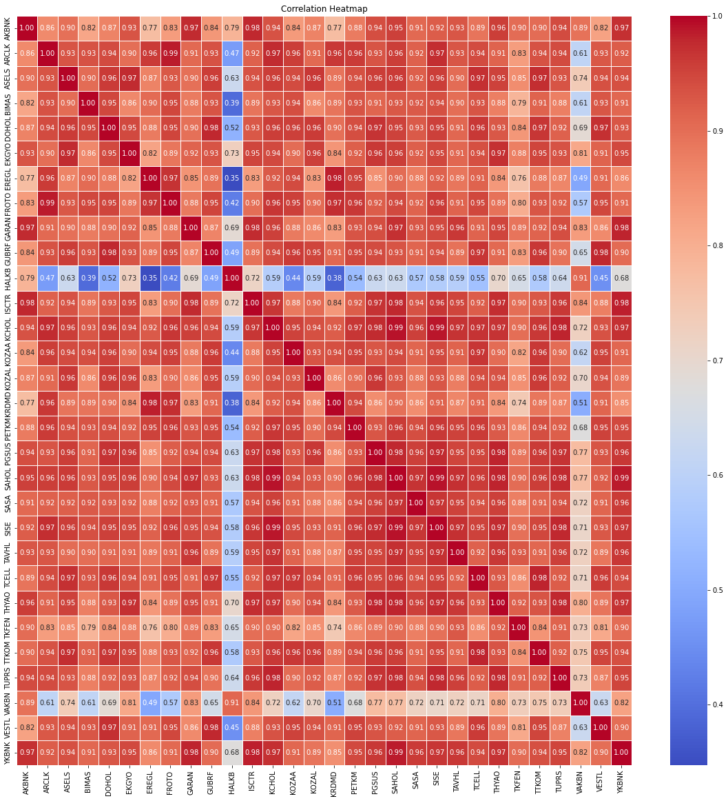
    


```python
correlation_matrix_one = test_data_one.corr()

plt.figure(figsize=(20, 20))
sns.heatmap(correlation_matrix_one, annot=True, cmap='coolwarm', fmt='.2f', linewidths=.5)
plt.title('Correlation Heatmap')

plt.show()
```


    
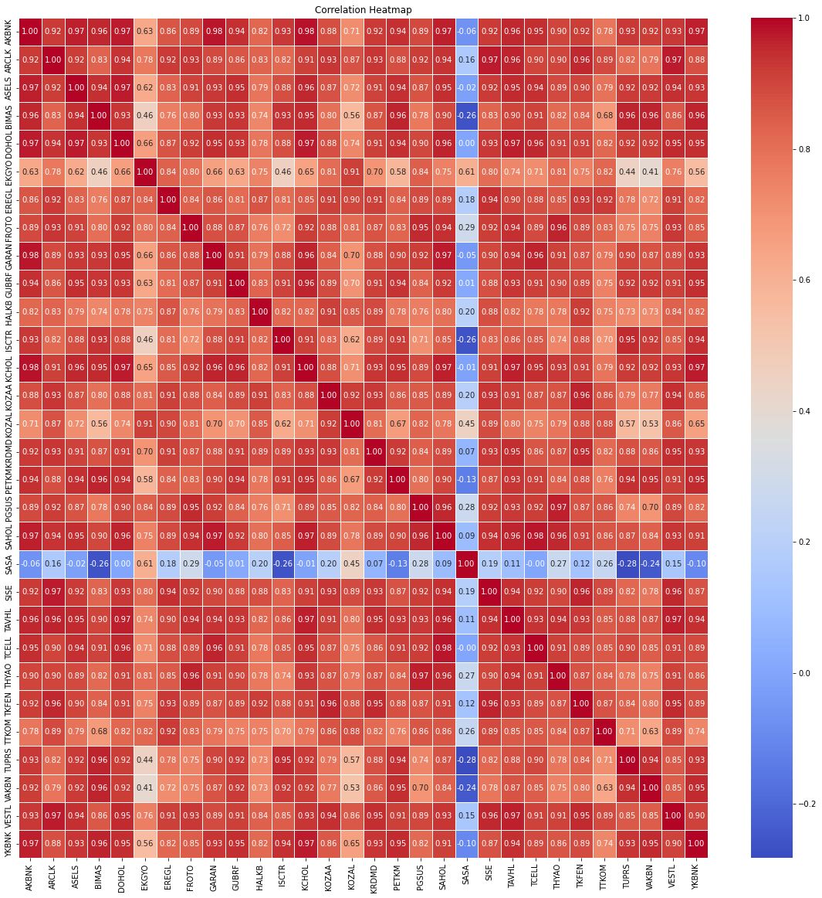
    


**Step 4.1 - Choosing First Pairs**


```python
stock1_1="AKBNK"
stock1_2="GARAN"
```

**4.1.1 - We chose AKBNK and GARAN due to their significant correlation both in Train and Test Correlation matrices (0.97, 0.98)**


```python
plt.figure(figsize=(10,10))
plt.plot(merged_stocks_df[[stock1_1,stock1_2]])
```


    [<matplotlib.lines.Line2D at 0x7fda3210ad00>,
     <matplotlib.lines.Line2D at 0x7fda3210ae50>]


    
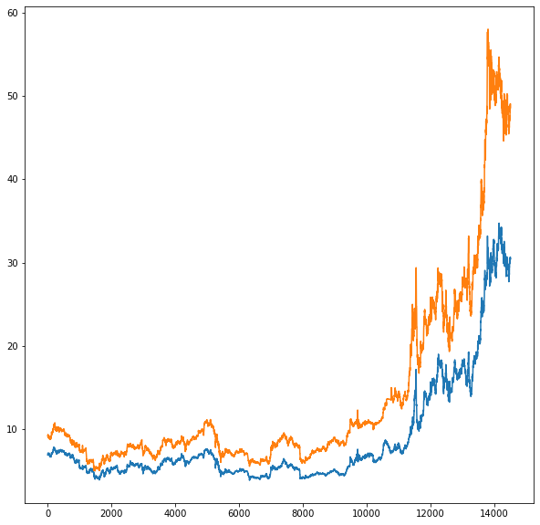
    


_Figure : Historical Plot of GARAN and AKBNK_


```python
first_pairs_train=train_data_one[['timestamp',stock1_1,stock1_2]]
first_pairs_test=test_data_one[['timestamp',stock1_1,stock1_2]]
```

**4.1.2 - Splitting Train and Test data for AKBNK and GARAN (GARAN is the y_ variable)**


```python
X_first = first_pairs_train[stock1_1]
y_first =first_pairs_train[stock1_2]
X_first = X_first.values.reshape(-1, 1)
```

**4.1.3 - Initiating Linear Regression Model, Getting Predicted y_ values(GARAN), Plotting Real Train Data(AKBNK, GARAN) and Regression Line** 


```python
model_1 = LinearRegression()

model_1.fit(X_first, y_first)

slope_1 = model_1.coef_[0]
intercept_1 = model_1.intercept_

y_first_pred = model_1.predict(X_first)

plt.figure(figsize = (10,10))
plt.scatter(X_first, y_first, label='Actual Data')
plt.plot(X_first, y_first_pred, color='red', label=f'Regression Line (y = {slope_1:.2f}x + {intercept_1:.2f})')
plt.xlabel('Price of Stock 1')
plt.ylabel('Price of Stock 2')
plt.title('Linear Regression of Two Stocks')
plt.legend()
plt.show()
```


    
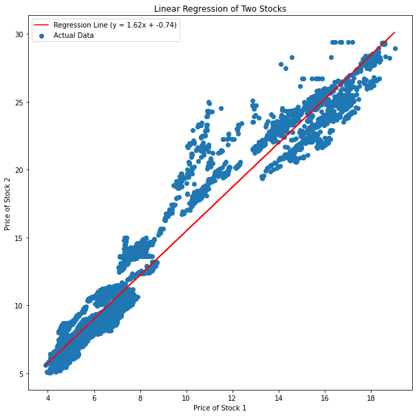
    


**4.1.4 - Getting R-squared value, 0.93 means Linear Model will be sufficient in our iterations.**


```python
r_squared_1 = model_1.score(X_first, y_first)
print("R-squared value:", r_squared_1)
```

    R-squared value: 0.9504428679512538


**4.1.5 - Splitting Test values**


```python
X_first_test = first_pairs_test['AKBNK']
y_first_test = first_pairs_test['GARAN'] 
X_first_test = X_first_test.values.reshape(-1, 1)
```

**4.1.6 - Predicting values in Test dataframe(GARAN). Then labeling as ['GARAN_pred']. We will use Test dataframe in our further iterations.**


```python
first_pairs_test['GARAN_pred'] = model_1.predict(X_first_test)
```

    /var/folders/gv/_ncn2cr93xg8y4xyrtc1d3z80000gn/T/ipykernel_11833/2006014318.py:1: SettingWithCopyWarning: 
    A value is trying to be set on a copy of a slice from a DataFrame.
    Try using .loc[row_indexer,col_indexer] = value instead
    
    See the caveats in the documentation: https://pandas.pydata.org/pandas-docs/stable/user_guide/indexing.html#returning-a-view-versus-a-copy
      first_pairs_test['GARAN_pred'] = model_1.predict(X_first_test)


**4.1.7 - Getting Residuals**


```python
first_pairs_test['Residuals'] = (first_pairs_test['GARAN'] - first_pairs_test['GARAN_pred'])/((slope_1)**2 + 1**2)**(1/2)
```

    /var/folders/gv/_ncn2cr93xg8y4xyrtc1d3z80000gn/T/ipykernel_11833/3616197826.py:1: SettingWithCopyWarning: 
    A value is trying to be set on a copy of a slice from a DataFrame.
    Try using .loc[row_indexer,col_indexer] = value instead
    
    See the caveats in the documentation: https://pandas.pydata.org/pandas-docs/stable/user_guide/indexing.html#returning-a-view-versus-a-copy
      first_pairs_test['Residuals'] = (first_pairs_test['GARAN'] - first_pairs_test['GARAN_pred'])/((slope_1)**2 + 1**2)**(1/2)


```python
first_pairs_test
```


<div>
<style scoped>
    .dataframe tbody tr th:only-of-type {
        vertical-align: middle;
    }

    .dataframe tbody tr th {
        vertical-align: top;
    }

    .dataframe thead th {
        text-align: right;
    }
</style>
<table border="1" class="dataframe">
  <thead>
    <tr style="text-align: right;">
      <th></th>
      <th>timestamp</th>
      <th>AKBNK</th>
      <th>GARAN</th>
      <th>GARAN_pred</th>
      <th>Residuals</th>
    </tr>
  </thead>
  <tbody>
    <tr>
      <th>12931</th>
      <td>2023-04-03 09:00:00+03:00</td>
      <td>16.82</td>
      <td>25.6981</td>
      <td>26.538788</td>
      <td>-0.441288</td>
    </tr>
    <tr>
      <th>12932</th>
      <td>2023-04-03 10:00:00+03:00</td>
      <td>16.90</td>
      <td>25.7352</td>
      <td>26.668509</td>
      <td>-0.489906</td>
    </tr>
    <tr>
      <th>12933</th>
      <td>2023-04-03 11:00:00+03:00</td>
      <td>16.90</td>
      <td>25.9025</td>
      <td>26.668509</td>
      <td>-0.402088</td>
    </tr>
    <tr>
      <th>12934</th>
      <td>2023-04-03 12:00:00+03:00</td>
      <td>16.84</td>
      <td>25.7352</td>
      <td>26.571218</td>
      <td>-0.438837</td>
    </tr>
    <tr>
      <th>12935</th>
      <td>2023-04-03 13:00:00+03:00</td>
      <td>16.85</td>
      <td>25.7352</td>
      <td>26.587433</td>
      <td>-0.447348</td>
    </tr>
    <tr>
      <th>...</th>
      <td>...</td>
      <td>...</td>
      <td>...</td>
      <td>...</td>
      <td>...</td>
    </tr>
    <tr>
      <th>14509</th>
      <td>2023-11-21 09:00:00+03:00</td>
      <td>30.68</td>
      <td>49.0000</td>
      <td>49.013034</td>
      <td>-0.006842</td>
    </tr>
    <tr>
      <th>14510</th>
      <td>2023-11-21 10:00:00+03:00</td>
      <td>30.48</td>
      <td>49.0600</td>
      <td>48.688730</td>
      <td>0.194884</td>
    </tr>
    <tr>
      <th>14511</th>
      <td>2023-11-21 11:00:00+03:00</td>
      <td>30.48</td>
      <td>48.7600</td>
      <td>48.688730</td>
      <td>0.037410</td>
    </tr>
    <tr>
      <th>14512</th>
      <td>2023-11-21 12:00:00+03:00</td>
      <td>30.50</td>
      <td>48.6800</td>
      <td>48.721161</td>
      <td>-0.021606</td>
    </tr>
    <tr>
      <th>14513</th>
      <td>2023-11-21 13:00:00+03:00</td>
      <td>30.46</td>
      <td>48.5800</td>
      <td>48.656300</td>
      <td>-0.040051</td>
    </tr>
  </tbody>
</table>
<p>1583 rows × 5 columns</p>
</div>


**4.1.8 - Finding mean and standard deviation values for Residuals.**


```python
first_mean_res = np.mean(first_pairs_test['Residuals'])
first_sd_res = np.std(first_pairs_test['Residuals'])
```

**4.1.9 - Plotting Residuals and Lower and Upper control limits. CL's are chosen as +- 1.5 * standard deviation. CL's are also plotted.**


```python
plt.figure(figsize=(16,12))
plt.scatter(first_pairs_test.timestamp, first_pairs_test['Residuals'])
plt.axhline(y=first_mean_res, color="red", linestyle='--')
plt.axhline(y=first_mean_res + 1.5*first_sd_res, color="green", linestyle='--')
plt.axhline(y=first_mean_res - 1.5*first_sd_res, color="green", linestyle='--')
```


    <matplotlib.lines.Line2D at 0x7fda32133f10>


    
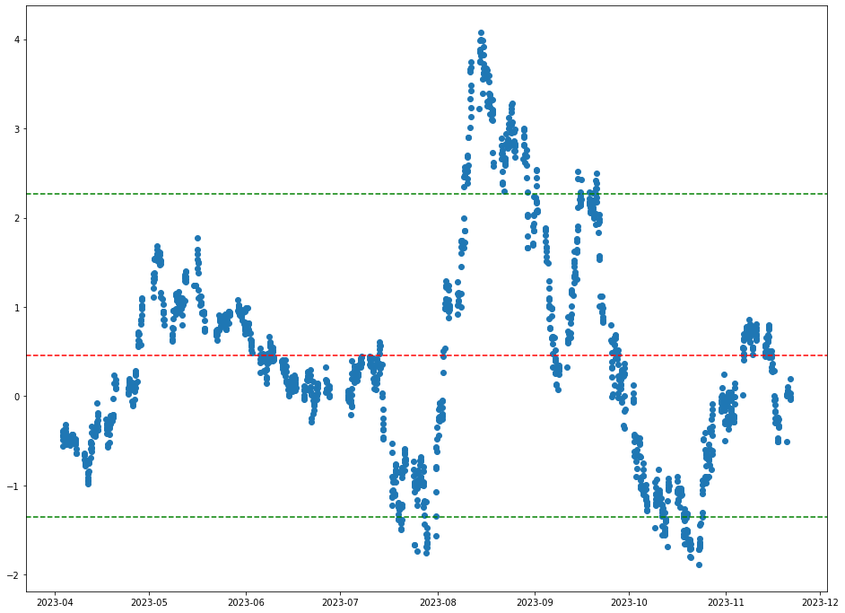
    


**4.2.1 - Finding BUY and SELL regions**

By definition, in _Pairs Trading_ if we have two stocks, named as stock_1 and stock_2 we need to sell stock_2, while we are buying stock_1

In control chart approximation, if a stock is **ABOVE** the **UPPER CONTROL LIMIT** we need to **SELL** the stock, while buying the another pair.

Similarly, if o a stock is **UNDER** the **LOWER CONTROL LIMIT**, we need to but that stock and sell the another pair.

In this manner, we created two dataframes for GARAN, which we run Linear Regression with test data of it.


```python
buy_garan = first_pairs_test[first_pairs_test['Residuals']<(first_mean_res - 1.5*first_sd_res)]
sell_garan = first_pairs_test[first_pairs_test['Residuals']>(first_mean_res + 1.5*first_sd_res)]
```

**buy_garan**, represents the values for where Residuals of GARAN are laid under the *LCL*

**sell_garan**, represents the values for where Residuals of GARAN are laid over the *OCL*


```python
buy_garan
```


<div>
<style scoped>
    .dataframe tbody tr th:only-of-type {
        vertical-align: middle;
    }

    .dataframe tbody tr th {
        vertical-align: top;
    }

    .dataframe thead th {
        text-align: right;
    }
</style>
<table border="1" class="dataframe">
  <thead>
    <tr style="text-align: right;">
      <th></th>
      <th>timestamp</th>
      <th>AKBNK</th>
      <th>GARAN</th>
      <th>GARAN_pred</th>
      <th>Residuals</th>
    </tr>
  </thead>
  <tbody>
    <tr>
      <th>13631</th>
      <td>2023-07-19 11:00:00+03:00</td>
      <td>24.06</td>
      <td>35.64</td>
      <td>38.278582</td>
      <td>-1.385026</td>
    </tr>
    <tr>
      <th>13633</th>
      <td>2023-07-19 13:00:00+03:00</td>
      <td>24.24</td>
      <td>35.96</td>
      <td>38.570455</td>
      <td>-1.370262</td>
    </tr>
    <tr>
      <th>13639</th>
      <td>2023-07-20 09:00:00+03:00</td>
      <td>25.46</td>
      <td>37.70</td>
      <td>40.548708</td>
      <td>-1.495323</td>
    </tr>
    <tr>
      <th>13640</th>
      <td>2023-07-20 10:00:00+03:00</td>
      <td>25.10</td>
      <td>37.14</td>
      <td>39.964961</td>
      <td>-1.482858</td>
    </tr>
    <tr>
      <th>13641</th>
      <td>2023-07-20 11:00:00+03:00</td>
      <td>25.22</td>
      <td>37.44</td>
      <td>40.159543</td>
      <td>-1.427523</td>
    </tr>
    <tr>
      <th>...</th>
      <td>...</td>
      <td>...</td>
      <td>...</td>
      <td>...</td>
      <td>...</td>
    </tr>
    <tr>
      <th>14304</th>
      <td>2023-10-23 14:00:00+03:00</td>
      <td>30.08</td>
      <td>45.00</td>
      <td>48.040123</td>
      <td>-1.595800</td>
    </tr>
    <tr>
      <th>14305</th>
      <td>2023-10-23 15:00:00+03:00</td>
      <td>30.28</td>
      <td>45.18</td>
      <td>48.364427</td>
      <td>-1.671547</td>
    </tr>
    <tr>
      <th>14306</th>
      <td>2023-10-23 16:00:00+03:00</td>
      <td>30.34</td>
      <td>45.34</td>
      <td>48.461718</td>
      <td>-1.638630</td>
    </tr>
    <tr>
      <th>14307</th>
      <td>2023-10-23 17:00:00+03:00</td>
      <td>30.50</td>
      <td>45.98</td>
      <td>48.721161</td>
      <td>-1.438871</td>
    </tr>
    <tr>
      <th>14308</th>
      <td>2023-10-23 18:00:00+03:00</td>
      <td>30.50</td>
      <td>46.00</td>
      <td>48.721161</td>
      <td>-1.428372</td>
    </tr>
  </tbody>
</table>
<p>68 rows × 5 columns</p>
</div>


```python
sell_garan
```


<div>
<style scoped>
    .dataframe tbody tr th:only-of-type {
        vertical-align: middle;
    }

    .dataframe tbody tr th {
        vertical-align: top;
    }

    .dataframe thead th {
        text-align: right;
    }
</style>
<table border="1" class="dataframe">
  <thead>
    <tr style="text-align: right;">
      <th></th>
      <th>timestamp</th>
      <th>AKBNK</th>
      <th>GARAN</th>
      <th>GARAN_pred</th>
      <th>Residuals</th>
    </tr>
  </thead>
  <tbody>
    <tr>
      <th>13781</th>
      <td>2023-08-09 11:00:00+03:00</td>
      <td>28.72</td>
      <td>50.30</td>
      <td>45.834858</td>
      <td>2.343811</td>
    </tr>
    <tr>
      <th>13782</th>
      <td>2023-08-09 12:00:00+03:00</td>
      <td>28.80</td>
      <td>50.65</td>
      <td>45.964579</td>
      <td>2.459438</td>
    </tr>
    <tr>
      <th>13783</th>
      <td>2023-08-09 13:00:00+03:00</td>
      <td>28.66</td>
      <td>50.55</td>
      <td>45.737567</td>
      <td>2.526108</td>
    </tr>
    <tr>
      <th>13784</th>
      <td>2023-08-09 14:00:00+03:00</td>
      <td>28.66</td>
      <td>50.45</td>
      <td>45.737567</td>
      <td>2.473617</td>
    </tr>
    <tr>
      <th>13785</th>
      <td>2023-08-09 15:00:00+03:00</td>
      <td>28.76</td>
      <td>50.80</td>
      <td>45.899719</td>
      <td>2.572221</td>
    </tr>
    <tr>
      <th>...</th>
      <td>...</td>
      <td>...</td>
      <td>...</td>
      <td>...</td>
      <td>...</td>
    </tr>
    <tr>
      <th>14072</th>
      <td>2023-09-20 12:00:00+03:00</td>
      <td>29.86</td>
      <td>52.00</td>
      <td>47.683389</td>
      <td>2.265845</td>
    </tr>
    <tr>
      <th>14073</th>
      <td>2023-09-20 13:00:00+03:00</td>
      <td>29.94</td>
      <td>52.25</td>
      <td>47.813110</td>
      <td>2.328980</td>
    </tr>
    <tr>
      <th>14074</th>
      <td>2023-09-20 14:00:00+03:00</td>
      <td>29.94</td>
      <td>52.25</td>
      <td>47.813110</td>
      <td>2.328980</td>
    </tr>
    <tr>
      <th>14075</th>
      <td>2023-09-20 15:00:00+03:00</td>
      <td>30.00</td>
      <td>52.45</td>
      <td>47.910402</td>
      <td>2.382894</td>
    </tr>
    <tr>
      <th>14076</th>
      <td>2023-09-20 16:00:00+03:00</td>
      <td>29.86</td>
      <td>52.45</td>
      <td>47.683389</td>
      <td>2.502056</td>
    </tr>
  </tbody>
</table>
<p>156 rows × 5 columns</p>
</div>


**4.2.2 - Determining _BUY_ window for GARAN**

In the table buy_garan, we can see where GARAN should be bought. To ease of simulation, we decided to choose a buying window, then examine if we are profitable or not.

In pairs trading, if the residual value is out of the control limits, it will try to turn back to the mean residual value.

Thus, since after _2023-10-24_ there's no value under LCL, we decided to start simulation at this date. 

Then, by checking the Residuals table, we found the **first closest** point to the residuals mean. Which appeared as _2023-11-10_


```python
buy_window = first_pairs_test[(first_pairs_test['timestamp'] > "2023-10-24") & (first_pairs_test['timestamp'] < "2023-11-10")]
```


```python
plt.figure(figsize=(16,12))
plt.scatter(buy_window.timestamp, buy_window.Residuals)
plt.axhline(y=first_mean_res, color="red", linestyle='--')
plt.axhline(y=first_mean_res + 1.5*first_sd_res, color="green", linestyle='--')
plt.axhline(y=first_mean_res - 1.5*first_sd_res, color="green", linestyle='--')
plt.axvline(x=buy_window.timestamp.loc[14309], color="blue", linestyle='--')
plt.axvline(x=buy_window.timestamp.loc[14406], color="blue", linestyle='--')
```


    <matplotlib.lines.Line2D at 0x7fda31aebfa0>


    
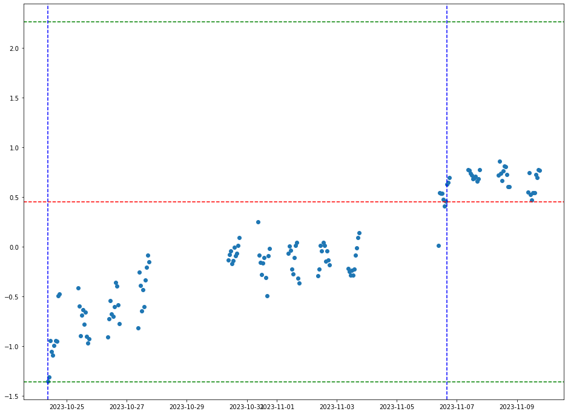
    


To simulate, we assumed we are holding **1000 TRY** of **GARAN**. Then we compared two values, first Value is what will happen if we hold *GARAN* for this time period, and the second is what will happen if we've switched to the *AKBNK*


```python
garan_buy_eop = (1000/buy_window.loc[14309].GARAN)*buy_window.loc[14406].GARAN
garan_buy_eop
```


    1074.8387096774193


```python
akbnk_buy_eop = (1000/buy_window.loc[14309].AKBNK)*buy_window.loc[14406].AKBNK
akbnk_buy_eop
```


    994.140625


It is clearly visible that our BUY window suggested us the true path. We have 1074TRY revenue in GARAN if we determine our position as buy_garan.

**4.2.3 - Determining _SELL_ window for GARAN**

In the table sell_garan, we can see where GARAN should be sold. To ease of simulation, we decided to choose a selling window, then examine if we are profitable or not.

In pairs trading, if the residual value is out of the control limits, it will try to turn back to the mean residual value.

Thus, since after _2023-09-20_ there's no value Over UCL, we decided to start simulation at this date. 

Then, by checking the Residuals table, we found the **first closest** point to the residuals mean. Which appeared as _2023-09-26_


```python
sell_window = first_pairs_test[(first_pairs_test['timestamp'] > "2023-09-20") & (first_pairs_test['timestamp'] < "2023-09-26")]
```


```python
sell_window
```


<div>
<style scoped>
    .dataframe tbody tr th:only-of-type {
        vertical-align: middle;
    }

    .dataframe tbody tr th {
        vertical-align: top;
    }

    .dataframe thead th {
        text-align: right;
    }
</style>
<table border="1" class="dataframe">
  <thead>
    <tr style="text-align: right;">
      <th></th>
      <th>timestamp</th>
      <th>AKBNK</th>
      <th>GARAN</th>
      <th>GARAN_pred</th>
      <th>Residuals</th>
    </tr>
  </thead>
  <tbody>
    <tr>
      <th>14069</th>
      <td>2023-09-20 09:00:00+03:00</td>
      <td>29.06</td>
      <td>50.05</td>
      <td>46.386174</td>
      <td>1.923189</td>
    </tr>
    <tr>
      <th>14070</th>
      <td>2023-09-20 10:00:00+03:00</td>
      <td>29.60</td>
      <td>51.15</td>
      <td>47.261794</td>
      <td>2.040969</td>
    </tr>
    <tr>
      <th>14071</th>
      <td>2023-09-20 11:00:00+03:00</td>
      <td>29.84</td>
      <td>52.25</td>
      <td>47.650959</td>
      <td>2.414096</td>
    </tr>
    <tr>
      <th>14072</th>
      <td>2023-09-20 12:00:00+03:00</td>
      <td>29.86</td>
      <td>52.00</td>
      <td>47.683389</td>
      <td>2.265845</td>
    </tr>
    <tr>
      <th>14073</th>
      <td>2023-09-20 13:00:00+03:00</td>
      <td>29.94</td>
      <td>52.25</td>
      <td>47.813110</td>
      <td>2.328980</td>
    </tr>
    <tr>
      <th>14074</th>
      <td>2023-09-20 14:00:00+03:00</td>
      <td>29.94</td>
      <td>52.25</td>
      <td>47.813110</td>
      <td>2.328980</td>
    </tr>
    <tr>
      <th>14075</th>
      <td>2023-09-20 15:00:00+03:00</td>
      <td>30.00</td>
      <td>52.45</td>
      <td>47.910402</td>
      <td>2.382894</td>
    </tr>
    <tr>
      <th>14076</th>
      <td>2023-09-20 16:00:00+03:00</td>
      <td>29.86</td>
      <td>52.45</td>
      <td>47.683389</td>
      <td>2.502056</td>
    </tr>
    <tr>
      <th>14077</th>
      <td>2023-09-20 17:00:00+03:00</td>
      <td>29.56</td>
      <td>51.35</td>
      <td>47.196933</td>
      <td>2.179998</td>
    </tr>
    <tr>
      <th>14078</th>
      <td>2023-09-20 18:00:00+03:00</td>
      <td>29.60</td>
      <td>51.50</td>
      <td>47.261794</td>
      <td>2.224689</td>
    </tr>
    <tr>
      <th>14079</th>
      <td>2023-09-21 09:00:00+03:00</td>
      <td>29.94</td>
      <td>51.50</td>
      <td>47.813110</td>
      <td>1.935296</td>
    </tr>
    <tr>
      <th>14080</th>
      <td>2023-09-21 10:00:00+03:00</td>
      <td>30.52</td>
      <td>52.25</td>
      <td>48.753591</td>
      <td>1.835310</td>
    </tr>
    <tr>
      <th>14081</th>
      <td>2023-09-21 11:00:00+03:00</td>
      <td>30.50</td>
      <td>52.45</td>
      <td>48.721161</td>
      <td>1.957316</td>
    </tr>
    <tr>
      <th>14082</th>
      <td>2023-09-21 12:00:00+03:00</td>
      <td>30.44</td>
      <td>52.40</td>
      <td>48.623870</td>
      <td>1.982139</td>
    </tr>
    <tr>
      <th>14083</th>
      <td>2023-09-21 13:00:00+03:00</td>
      <td>30.68</td>
      <td>52.90</td>
      <td>49.013034</td>
      <td>2.040318</td>
    </tr>
    <tr>
      <th>14084</th>
      <td>2023-09-21 14:00:00+03:00</td>
      <td>30.18</td>
      <td>51.20</td>
      <td>48.202275</td>
      <td>1.573545</td>
    </tr>
    <tr>
      <th>14085</th>
      <td>2023-09-21 15:00:00+03:00</td>
      <td>30.16</td>
      <td>51.15</td>
      <td>48.169845</td>
      <td>1.564322</td>
    </tr>
    <tr>
      <th>14086</th>
      <td>2023-09-21 16:00:00+03:00</td>
      <td>30.66</td>
      <td>51.90</td>
      <td>48.980604</td>
      <td>1.532429</td>
    </tr>
    <tr>
      <th>14087</th>
      <td>2023-09-21 17:00:00+03:00</td>
      <td>31.24</td>
      <td>51.85</td>
      <td>49.921085</td>
      <td>1.012513</td>
    </tr>
    <tr>
      <th>14088</th>
      <td>2023-09-21 18:00:00+03:00</td>
      <td>31.20</td>
      <td>52.00</td>
      <td>49.856224</td>
      <td>1.125296</td>
    </tr>
    <tr>
      <th>14089</th>
      <td>2023-09-22 09:00:00+03:00</td>
      <td>31.20</td>
      <td>52.00</td>
      <td>49.856224</td>
      <td>1.125296</td>
    </tr>
    <tr>
      <th>14090</th>
      <td>2023-09-22 10:00:00+03:00</td>
      <td>31.08</td>
      <td>51.60</td>
      <td>49.661642</td>
      <td>1.017469</td>
    </tr>
    <tr>
      <th>14091</th>
      <td>2023-09-22 11:00:00+03:00</td>
      <td>31.26</td>
      <td>51.75</td>
      <td>49.953515</td>
      <td>0.942998</td>
    </tr>
    <tr>
      <th>14092</th>
      <td>2023-09-22 12:00:00+03:00</td>
      <td>31.20</td>
      <td>51.75</td>
      <td>49.856224</td>
      <td>0.994068</td>
    </tr>
    <tr>
      <th>14093</th>
      <td>2023-09-22 13:00:00+03:00</td>
      <td>31.44</td>
      <td>52.05</td>
      <td>50.245388</td>
      <td>0.947264</td>
    </tr>
    <tr>
      <th>14094</th>
      <td>2023-09-22 14:00:00+03:00</td>
      <td>31.08</td>
      <td>51.30</td>
      <td>49.661642</td>
      <td>0.859995</td>
    </tr>
    <tr>
      <th>14095</th>
      <td>2023-09-22 15:00:00+03:00</td>
      <td>30.90</td>
      <td>51.25</td>
      <td>49.369768</td>
      <td>0.986958</td>
    </tr>
    <tr>
      <th>14096</th>
      <td>2023-09-22 16:00:00+03:00</td>
      <td>31.14</td>
      <td>51.45</td>
      <td>49.758933</td>
      <td>0.887663</td>
    </tr>
    <tr>
      <th>14097</th>
      <td>2023-09-22 17:00:00+03:00</td>
      <td>30.84</td>
      <td>50.85</td>
      <td>49.272477</td>
      <td>0.828062</td>
    </tr>
    <tr>
      <th>14098</th>
      <td>2023-09-22 18:00:00+03:00</td>
      <td>30.80</td>
      <td>50.80</td>
      <td>49.207616</td>
      <td>0.835863</td>
    </tr>
    <tr>
      <th>14099</th>
      <td>2023-09-25 09:00:00+03:00</td>
      <td>30.94</td>
      <td>50.95</td>
      <td>49.434629</td>
      <td>0.795438</td>
    </tr>
    <tr>
      <th>14100</th>
      <td>2023-09-25 10:00:00+03:00</td>
      <td>31.20</td>
      <td>51.05</td>
      <td>49.856224</td>
      <td>0.626629</td>
    </tr>
    <tr>
      <th>14101</th>
      <td>2023-09-25 11:00:00+03:00</td>
      <td>31.32</td>
      <td>51.20</td>
      <td>50.050806</td>
      <td>0.603227</td>
    </tr>
    <tr>
      <th>14102</th>
      <td>2023-09-25 12:00:00+03:00</td>
      <td>31.74</td>
      <td>51.35</td>
      <td>50.731844</td>
      <td>0.324478</td>
    </tr>
    <tr>
      <th>14103</th>
      <td>2023-09-25 13:00:00+03:00</td>
      <td>31.98</td>
      <td>51.85</td>
      <td>51.121008</td>
      <td>0.382657</td>
    </tr>
    <tr>
      <th>14104</th>
      <td>2023-09-25 14:00:00+03:00</td>
      <td>31.58</td>
      <td>51.40</td>
      <td>50.472401</td>
      <td>0.486909</td>
    </tr>
    <tr>
      <th>14105</th>
      <td>2023-09-25 15:00:00+03:00</td>
      <td>31.78</td>
      <td>51.40</td>
      <td>50.796705</td>
      <td>0.316678</td>
    </tr>
    <tr>
      <th>14106</th>
      <td>2023-09-25 16:00:00+03:00</td>
      <td>32.30</td>
      <td>52.05</td>
      <td>51.639894</td>
      <td>0.215270</td>
    </tr>
    <tr>
      <th>14107</th>
      <td>2023-09-25 17:00:00+03:00</td>
      <td>32.28</td>
      <td>51.60</td>
      <td>51.607464</td>
      <td>-0.003918</td>
    </tr>
    <tr>
      <th>14108</th>
      <td>2023-09-25 18:00:00+03:00</td>
      <td>32.22</td>
      <td>51.55</td>
      <td>51.510173</td>
      <td>0.020906</td>
    </tr>
  </tbody>
</table>
</div>


```python
plt.figure(figsize=(16,12))
plt.scatter(sell_window.timestamp, sell_window.Residuals)
plt.axhline(y=first_mean_res, color="red", linestyle='--')
plt.axhline(y=first_mean_res + 1.5*first_sd_res, color="green", linestyle='--')
plt.axhline(y=first_mean_res - 1.5*first_sd_res, color="green", linestyle='--')
plt.axvline(x=sell_window.timestamp.loc[14076], color="blue", linestyle='--')
plt.axvline(x=sell_window.timestamp.loc[14100], color="blue", linestyle='--')
```


    <matplotlib.lines.Line2D at 0x7fda313eb520>


    
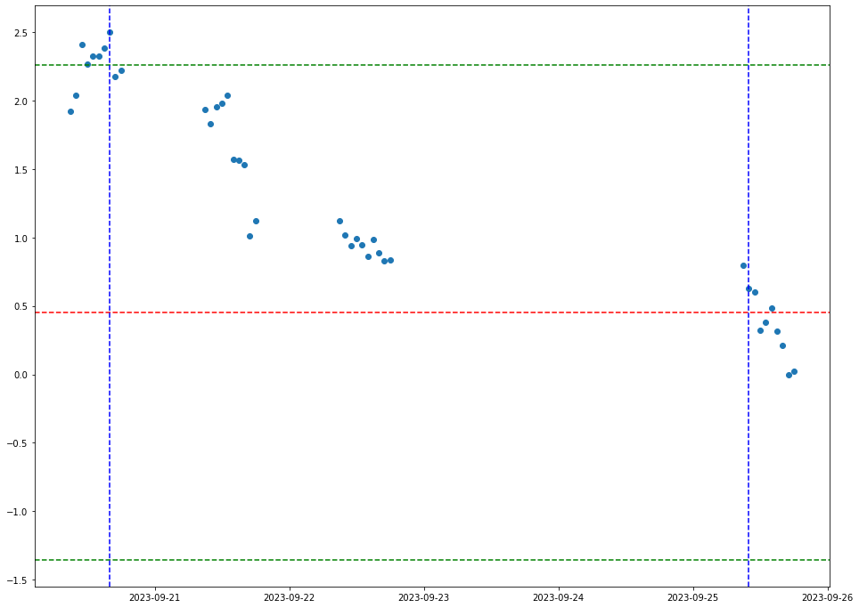
    


To simulate, we assumed we are holding **1000 TRY** of **GARAN**. Then we compared two values, first Value is what will happen if we hold *GARAN* for this time period, and the second is what will happen if we've switched to the *AKBNK*


```python
garan_sell_eop = (1000/sell_window.loc[14076].GARAN)*sell_window.loc[14100].GARAN
garan_sell_eop
```


    973.307912297426


```python
akbnk_sell_eop = (1000/sell_window.loc[14076].AKBNK)*sell_window.loc[14100].AKBNK
akbnk_sell_eop
```


    1044.876088412592


It is clearly visible that our SELL window suggested us the true path. We have 1044TRY revenue in AKBNK if we determine our position as sell_garan and buy akbnk.

**Step 5.1 - Choosing Second Pairs**


```python
stock2_1="SAHOL"
stock2_2="AKBNK"
```

**5.1.1 - We chose SAHOL and AKBNK due to their significant correlation both in Train and Test Correlation matrices (0.95, 0.97)**


```python
plt.figure(figsize=(10,10))
plt.plot(merged_stocks_df[[stock2_1,stock2_2]])
```


    [<matplotlib.lines.Line2D at 0x7fda315e7790>,
     <matplotlib.lines.Line2D at 0x7fda315e78b0>]


    
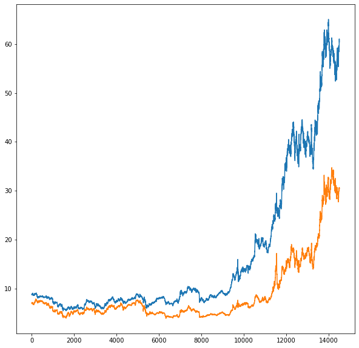
    


_Figure : Historical Plot of SAHOL and AKBNK_


```python
second_pairs_train=train_data_one[['timestamp',stock2_1,stock2_2]]
second_pairs_test=test_data_one[['timestamp',stock2_1,stock2_2]]
```

**5.1.2 - Splitting Train and Test data for SAHOL and AKBNK (AKBNK is the y_ variable)**


```python
X_second = second_pairs_train[stock2_1]
y_second =second_pairs_train[stock2_2]
X_second = X_second.values.reshape(-1, 1)
```

**5.1.3 - Initiating Linear Regression Model, Getting Predicted y_ values(AKBNK), Plotting Real Train Data(SAHOL, AKBNK) and Regression Line** 


```python
model_2 = LinearRegression()

model_2.fit(X_second, y_second)

slope_2 = model_2.coef_[0]
intercept_2 = model_2.intercept_

y_second_pred = model_2.predict(X_second)

plt.figure(figsize = (10,10))
plt.scatter(X_second, y_second, label='Actual Data')
plt.plot(X_second, y_second_pred, color='red', label=f'Regression Line (y = {slope_2:.2f}x + {intercept_2:.2f})')
plt.xlabel('Price of Stock 1')
plt.ylabel('Price of Stock 2')
plt.title('Linear Regression of Two Stocks')
plt.legend()
plt.show()
```


    
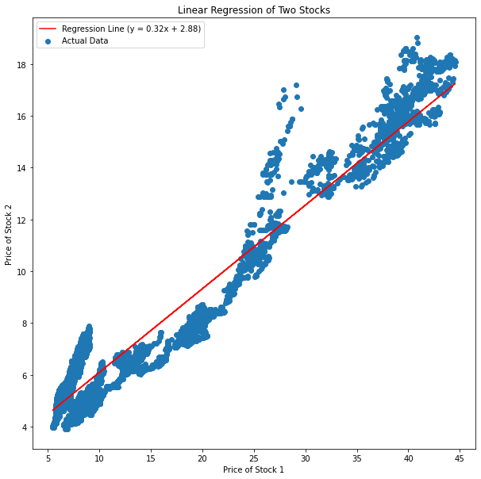
    


**5.1.4 - Getting R-squared value, 0.85 is relatively lower but still sufficient to our next iterations.**


```python
r_squared_2 = model_2.score(X_second, y_second)
print("R-squared value:", r_squared_2)
```

    R-squared value: 0.9112782251455447


**5.1.5 - Splitting Test values**


```python
X_second_test = second_pairs_test['SAHOL']
y_second_test = second_pairs_test['AKBNK'] 
X_second_test = X_second_test.values.reshape(-1, 1)
```

**5.1.6 - Predicting values in Test dataframe(AKBNK). Then labeling as ['AKBNK_pred']. We will use Test dataframe in our further iterations.**


```python
second_pairs_test['AKBNK_pred'] = model_2.predict(X_second_test)
```

    /var/folders/gv/_ncn2cr93xg8y4xyrtc1d3z80000gn/T/ipykernel_11833/2944440781.py:1: SettingWithCopyWarning: 
    A value is trying to be set on a copy of a slice from a DataFrame.
    Try using .loc[row_indexer,col_indexer] = value instead
    
    See the caveats in the documentation: https://pandas.pydata.org/pandas-docs/stable/user_guide/indexing.html#returning-a-view-versus-a-copy
      second_pairs_test['AKBNK_pred'] = model_2.predict(X_second_test)


**5.1.7 - Getting Residuals**


```python
second_pairs_test['Residuals'] = (second_pairs_test['AKBNK'] - second_pairs_test['AKBNK_pred'])/((slope_2)**2 + 1**2)**(1/2)

```

    /var/folders/gv/_ncn2cr93xg8y4xyrtc1d3z80000gn/T/ipykernel_11833/2907772942.py:1: SettingWithCopyWarning: 
    A value is trying to be set on a copy of a slice from a DataFrame.
    Try using .loc[row_indexer,col_indexer] = value instead
    
    See the caveats in the documentation: https://pandas.pydata.org/pandas-docs/stable/user_guide/indexing.html#returning-a-view-versus-a-copy
      second_pairs_test['Residuals'] = (second_pairs_test['AKBNK'] - second_pairs_test['AKBNK_pred'])/((slope_2)**2 + 1**2)**(1/2)


```python
second_pairs_test
```


<div>
<style scoped>
    .dataframe tbody tr th:only-of-type {
        vertical-align: middle;
    }

    .dataframe tbody tr th {
        vertical-align: top;
    }

    .dataframe thead th {
        text-align: right;
    }
</style>
<table border="1" class="dataframe">
  <thead>
    <tr style="text-align: right;">
      <th></th>
      <th>timestamp</th>
      <th>SAHOL</th>
      <th>AKBNK</th>
      <th>AKBNK_pred</th>
      <th>Residuals</th>
    </tr>
  </thead>
  <tbody>
    <tr>
      <th>12931</th>
      <td>2023-04-03 09:00:00+03:00</td>
      <td>38.00</td>
      <td>16.82</td>
      <td>15.131978</td>
      <td>1.606536</td>
    </tr>
    <tr>
      <th>12932</th>
      <td>2023-04-03 10:00:00+03:00</td>
      <td>37.26</td>
      <td>16.90</td>
      <td>14.893318</td>
      <td>1.909814</td>
    </tr>
    <tr>
      <th>12933</th>
      <td>2023-04-03 11:00:00+03:00</td>
      <td>37.22</td>
      <td>16.90</td>
      <td>14.880417</td>
      <td>1.922092</td>
    </tr>
    <tr>
      <th>12934</th>
      <td>2023-04-03 12:00:00+03:00</td>
      <td>37.10</td>
      <td>16.84</td>
      <td>14.841715</td>
      <td>1.901822</td>
    </tr>
    <tr>
      <th>12935</th>
      <td>2023-04-03 13:00:00+03:00</td>
      <td>37.16</td>
      <td>16.85</td>
      <td>14.861066</td>
      <td>1.892922</td>
    </tr>
    <tr>
      <th>...</th>
      <td>...</td>
      <td>...</td>
      <td>...</td>
      <td>...</td>
      <td>...</td>
    </tr>
    <tr>
      <th>14509</th>
      <td>2023-11-21 09:00:00+03:00</td>
      <td>61.05</td>
      <td>30.68</td>
      <td>22.565930</td>
      <td>7.722380</td>
    </tr>
    <tr>
      <th>14510</th>
      <td>2023-11-21 10:00:00+03:00</td>
      <td>60.60</td>
      <td>30.48</td>
      <td>22.420799</td>
      <td>7.670160</td>
    </tr>
    <tr>
      <th>14511</th>
      <td>2023-11-21 11:00:00+03:00</td>
      <td>60.40</td>
      <td>30.48</td>
      <td>22.356296</td>
      <td>7.731549</td>
    </tr>
    <tr>
      <th>14512</th>
      <td>2023-11-21 12:00:00+03:00</td>
      <td>60.45</td>
      <td>30.50</td>
      <td>22.372422</td>
      <td>7.735237</td>
    </tr>
    <tr>
      <th>14513</th>
      <td>2023-11-21 13:00:00+03:00</td>
      <td>60.40</td>
      <td>30.46</td>
      <td>22.356296</td>
      <td>7.712515</td>
    </tr>
  </tbody>
</table>
<p>1583 rows × 5 columns</p>
</div>


**5.1.8 - Finding mean and standard deviation values for Residuals.**


```python
second_mean_res = np.mean(second_pairs_test['Residuals'])
second_sd_res = np.std(second_pairs_test['Residuals'])
```

**5.1.9 - Plotting Residuals and Lower and Upper control limits. CL's are chosen as +- 1.5 * standard deviation. CL's are also plotted.**


```python
plt.figure(figsize=(16,12))
plt.scatter(second_pairs_test.timestamp, second_pairs_test['Residuals'])
plt.axhline(y=second_mean_res, color="red", linestyle='--')
plt.axhline(y=second_mean_res + 1.5*second_sd_res, color="green", linestyle='--')
plt.axhline(y=second_mean_res - 1.5*second_sd_res, color="green", linestyle='--')
```


    <matplotlib.lines.Line2D at 0x7fda31394d90>


    
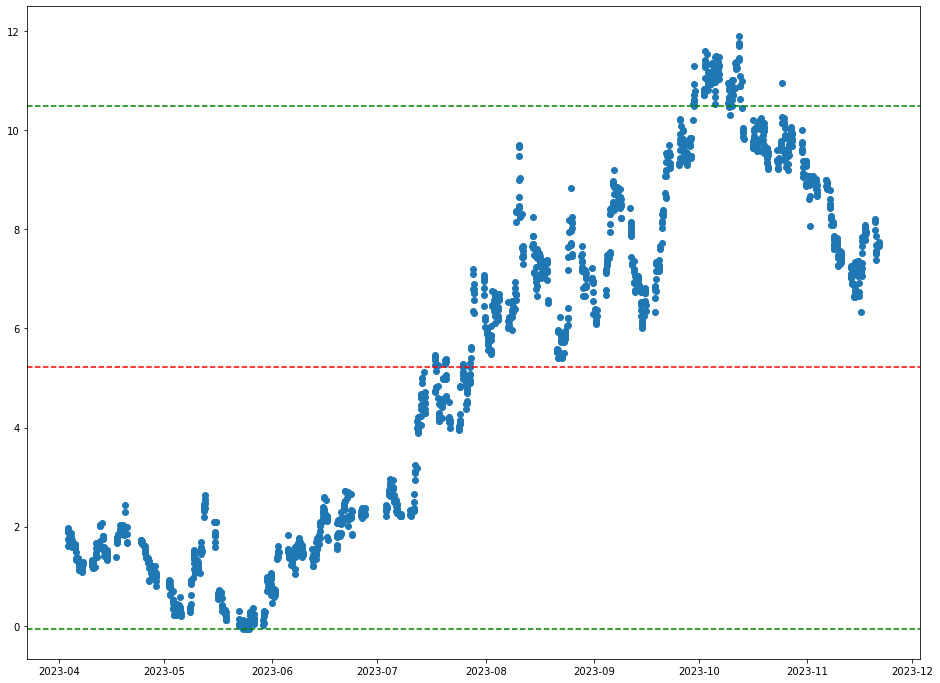
    


**5.2.1 - Finding BUY and SELL regions**


```python
buy_akbnk = second_pairs_test[second_pairs_test['Residuals']<(second_mean_res - 1.5*second_sd_res)]
sell_akbnk = second_pairs_test[second_pairs_test['Residuals']>(second_mean_res + 1.5*second_sd_res)]
```

Applying similar methodology as part 4.2.1


```python
buy_akbnk
```


<div>
<style scoped>
    .dataframe tbody tr th:only-of-type {
        vertical-align: middle;
    }

    .dataframe tbody tr th {
        vertical-align: top;
    }

    .dataframe thead th {
        text-align: right;
    }
</style>
<table border="1" class="dataframe">
  <thead>
    <tr style="text-align: right;">
      <th></th>
      <th>timestamp</th>
      <th>SAHOL</th>
      <th>AKBNK</th>
      <th>AKBNK_pred</th>
      <th>Residuals</th>
    </tr>
  </thead>
  <tbody>
    <tr>
      <th>13275</th>
      <td>2023-05-25 09:00:00+03:00</td>
      <td>34.8</td>
      <td>14.03</td>
      <td>14.099933</td>
      <td>-0.066557</td>
    </tr>
  </tbody>
</table>
</div>


We couldn't find any range to indicate buy AKBNK.


```python
sell_akbnk
```


<div>
<style scoped>
    .dataframe tbody tr th:only-of-type {
        vertical-align: middle;
    }

    .dataframe tbody tr th {
        vertical-align: top;
    }

    .dataframe thead th {
        text-align: right;
    }
</style>
<table border="1" class="dataframe">
  <thead>
    <tr style="text-align: right;">
      <th></th>
      <th>timestamp</th>
      <th>SAHOL</th>
      <th>AKBNK</th>
      <th>AKBNK_pred</th>
      <th>Residuals</th>
    </tr>
  </thead>
  <tbody>
    <tr>
      <th>14140</th>
      <td>2023-09-29 10:00:00+03:00</td>
      <td>59.45</td>
      <td>33.12</td>
      <td>22.049907</td>
      <td>10.535707</td>
    </tr>
    <tr>
      <th>14141</th>
      <td>2023-09-29 11:00:00+03:00</td>
      <td>59.65</td>
      <td>33.14</td>
      <td>22.114410</td>
      <td>10.493353</td>
    </tr>
    <tr>
      <th>14142</th>
      <td>2023-09-29 12:00:00+03:00</td>
      <td>59.55</td>
      <td>33.14</td>
      <td>22.082159</td>
      <td>10.524047</td>
    </tr>
    <tr>
      <th>14143</th>
      <td>2023-09-29 13:00:00+03:00</td>
      <td>59.35</td>
      <td>33.16</td>
      <td>22.017656</td>
      <td>10.604471</td>
    </tr>
    <tr>
      <th>14144</th>
      <td>2023-09-29 14:00:00+03:00</td>
      <td>59.60</td>
      <td>33.24</td>
      <td>22.098285</td>
      <td>10.603873</td>
    </tr>
    <tr>
      <th>...</th>
      <td>...</td>
      <td>...</td>
      <td>...</td>
      <td>...</td>
      <td>...</td>
    </tr>
    <tr>
      <th>14236</th>
      <td>2023-10-12 16:00:00+03:00</td>
      <td>56.80</td>
      <td>32.36</td>
      <td>21.195245</td>
      <td>10.625800</td>
    </tr>
    <tr>
      <th>14237</th>
      <td>2023-10-12 17:00:00+03:00</td>
      <td>57.60</td>
      <td>32.90</td>
      <td>21.453256</td>
      <td>10.894176</td>
    </tr>
    <tr>
      <th>14238</th>
      <td>2023-10-12 18:00:00+03:00</td>
      <td>57.70</td>
      <td>32.92</td>
      <td>21.485508</td>
      <td>10.882516</td>
    </tr>
    <tr>
      <th>14239</th>
      <td>2023-10-13 09:00:00+03:00</td>
      <td>57.50</td>
      <td>32.96</td>
      <td>21.421005</td>
      <td>10.981974</td>
    </tr>
    <tr>
      <th>14316</th>
      <td>2023-10-24 16:00:00+03:00</td>
      <td>56.35</td>
      <td>32.56</td>
      <td>21.050113</td>
      <td>10.954271</td>
    </tr>
  </tbody>
</table>
<p>98 rows × 5 columns</p>
</div>


So, we will only do sell_akbnk.

**5.2.2 - Determining _SELL_ window for AKBNK**

In the table sell_akbnk, we can see where AKBNK should be sold. To ease of simulation, we decided to choose a selling window, then examine if we are profitable or not.

In pairs trading, if the residual value is out of the control limits, it will try to turn back to the mean residual value.

Thus, since after _2023-10-30_ there's no value Over UCL, we decided to start simulation at this date. Then, by checking the Residuals table, we found the **first closest** point to the residuals mean. Which appeared as _2023-11-17_


```python
sell_window_2 = second_pairs_test[(second_pairs_test['timestamp'] > "2023-10-30") & (second_pairs_test['timestamp'] < "2023-11-17")]
sell_window_2
```


<div>
<style scoped>
    .dataframe tbody tr th:only-of-type {
        vertical-align: middle;
    }

    .dataframe tbody tr th {
        vertical-align: top;
    }

    .dataframe thead th {
        text-align: right;
    }
</style>
<table border="1" class="dataframe">
  <thead>
    <tr style="text-align: right;">
      <th></th>
      <th>timestamp</th>
      <th>SAHOL</th>
      <th>AKBNK</th>
      <th>AKBNK_pred</th>
      <th>Residuals</th>
    </tr>
  </thead>
  <tbody>
    <tr>
      <th>14349</th>
      <td>2023-10-30 09:00:00+03:00</td>
      <td>54.90</td>
      <td>30.84</td>
      <td>20.582468</td>
      <td>9.762371</td>
    </tr>
    <tr>
      <th>14350</th>
      <td>2023-10-30 10:00:00+03:00</td>
      <td>54.95</td>
      <td>31.10</td>
      <td>20.598594</td>
      <td>9.994473</td>
    </tr>
    <tr>
      <th>14351</th>
      <td>2023-10-30 11:00:00+03:00</td>
      <td>54.65</td>
      <td>30.72</td>
      <td>20.501839</td>
      <td>9.724900</td>
    </tr>
    <tr>
      <th>14352</th>
      <td>2023-10-30 12:00:00+03:00</td>
      <td>54.65</td>
      <td>30.56</td>
      <td>20.501839</td>
      <td>9.572624</td>
    </tr>
    <tr>
      <th>14353</th>
      <td>2023-10-30 13:00:00+03:00</td>
      <td>54.90</td>
      <td>30.70</td>
      <td>20.582468</td>
      <td>9.629129</td>
    </tr>
    <tr>
      <th>...</th>
      <td>...</td>
      <td>...</td>
      <td>...</td>
      <td>...</td>
      <td>...</td>
    </tr>
    <tr>
      <th>14484</th>
      <td>2023-11-16 14:00:00+03:00</td>
      <td>58.85</td>
      <td>29.54</td>
      <td>21.856399</td>
      <td>7.312691</td>
    </tr>
    <tr>
      <th>14485</th>
      <td>2023-11-16 15:00:00+03:00</td>
      <td>58.85</td>
      <td>29.76</td>
      <td>21.856399</td>
      <td>7.522071</td>
    </tr>
    <tr>
      <th>14486</th>
      <td>2023-11-16 16:00:00+03:00</td>
      <td>58.70</td>
      <td>29.86</td>
      <td>21.808022</td>
      <td>7.663286</td>
    </tr>
    <tr>
      <th>14487</th>
      <td>2023-11-16 17:00:00+03:00</td>
      <td>58.40</td>
      <td>29.86</td>
      <td>21.711268</td>
      <td>7.755370</td>
    </tr>
    <tr>
      <th>14488</th>
      <td>2023-11-16 18:00:00+03:00</td>
      <td>58.50</td>
      <td>29.98</td>
      <td>21.743519</td>
      <td>7.838882</td>
    </tr>
  </tbody>
</table>
<p>140 rows × 5 columns</p>
</div>


```python
plt.figure(figsize=(16,12))
plt.scatter(sell_window_2.timestamp, sell_window_2.Residuals)
plt.axhline(y=second_mean_res, color="red", linestyle='--')
plt.axhline(y=second_mean_res + 1.5*second_sd_res, color="green", linestyle='--')
plt.axhline(y=second_mean_res - 1.5*second_sd_res, color="green", linestyle='--')
plt.axvline(x=sell_window_2.timestamp.loc[14354], color="blue", linestyle='--')
plt.axvline(x=sell_window_2.timestamp.loc[14479], color="blue", linestyle='--')
```


    <matplotlib.lines.Line2D at 0x7fda3152a1f0>


    
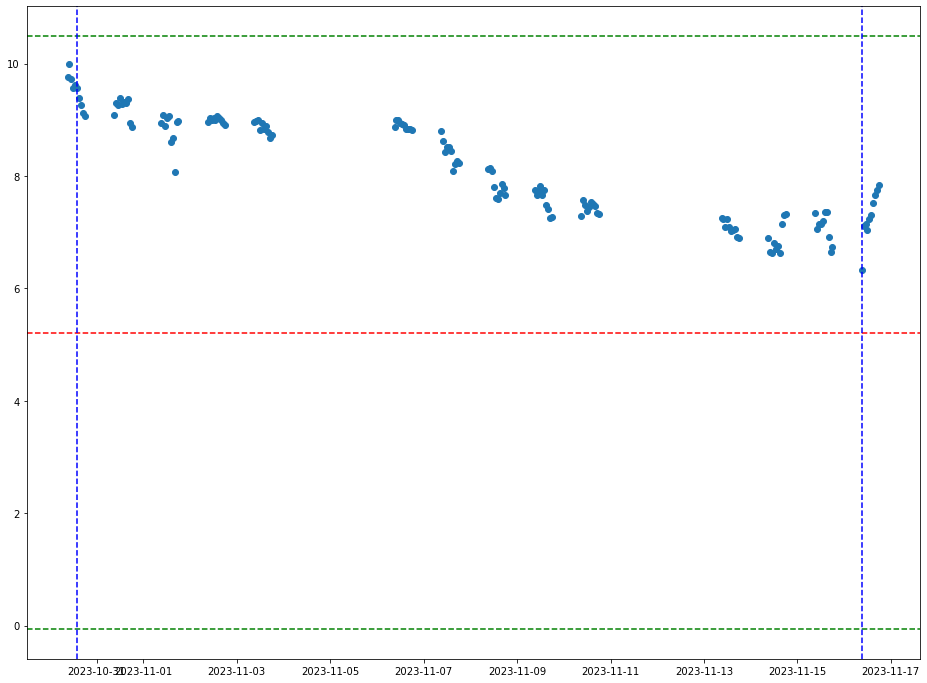
    


To simulate, we assumed we are holding **1000 TRY** of **AKBNK**. Then we compared two values, first Value is what will happen if we hold *AKBNK* for this time period, and the second is what will happen if we've switched to the *SAHOL*


```python
akbnk_sell_eop = (1000/sell_window_2.loc[14354].AKBNK)*sell_window_2.loc[14479].AKBNK
akbnk_sell_eop
```


    937.2138652714193


```python
sahol_sell_eop=(1000/sell_window_2.loc[14354].SAHOL)*sell_window_2.loc[14479].SAHOL
sahol_sell_eop
```


    1083.1050228310503


It is clearly visible that our SELL window suggested us the true path. We have 1083TRY revenue in SAHOL if we determine our position as sell_akbnk and buy SAHOL.

## END OF TASK ONE
