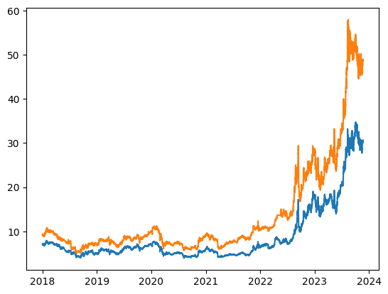
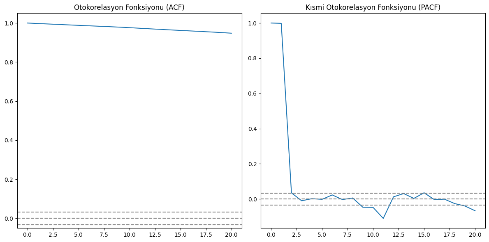
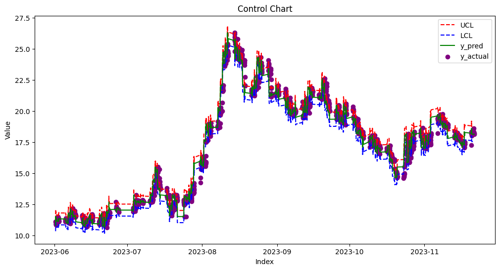
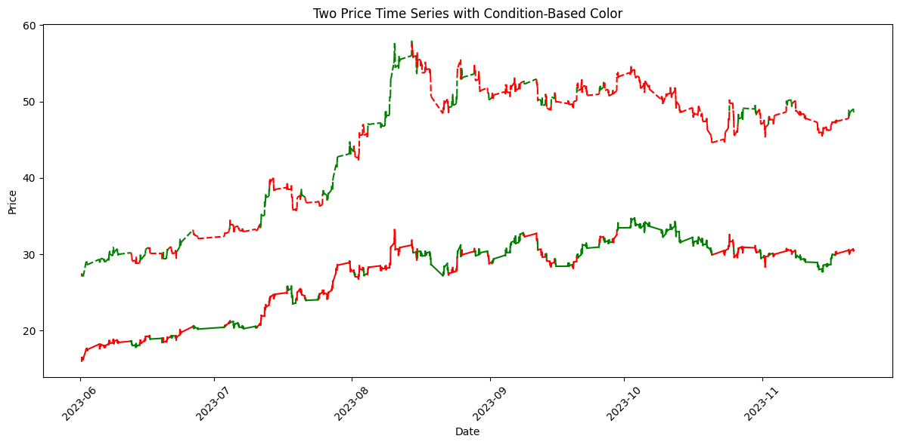

```python
import os
import numpy as np
import pandas as pd
import matplotlib.pyplot as plt
import seaborn as sns
from datetime import datetime
```

### **PROJECT PART TWO - TASK TWO**


```python
folder_path = 'data' 
files = [f for f in os.listdir(folder_path) if f.endswith('.csv')]
```


```python
all_data = pd.DataFrame()

for file in files:
    file_path = os.path.join(folder_path, file)
    df = pd.read_csv(file_path)
    all_data = pd.concat((all_data,df), ignore_index=True)
```


```python
grouped_df = all_data.groupby('short_name')
```


```python
stock_dfs=[]
for stock in all_data["short_name"].unique():
    df = grouped_df.get_group(stock).sort_values(by="timestamp").reset_index().drop("index", axis=1)
    stock_dfs.append(df)

```


```python
for i, df in enumerate(stock_dfs):
    df_pivoted = df.pivot(index='timestamp', columns='short_name', values='price')
    df_pivoted.columns = [f'{col}' for col in df_pivoted.columns]
    stock_dfs[i] = df_pivoted.reset_index()


merged_stocks_df = stock_dfs[0]
for i in range(1, len(stock_dfs)):
    merged_stocks_df = pd.merge(merged_stocks_df, stock_dfs[i], on='timestamp')

```


```python
merged_stocks_df['timestamp'] = pd.to_datetime(merged_stocks_df['timestamp'])
merged_stocks_df['timestamp']  = merged_stocks_df['timestamp'].dt.tz_convert('Europe/Istanbul')
```


```python
merged_stocks_df = merged_stocks_df.set_index("timestamp")
merged_stocks_df.index = merged_stocks_df.index.tz_localize(None)
```

Initial pairs in the regression analysis. 


```python
stock1="AKBNK"
stock2="GARAN"
```


```python
plt.plot(merged_stocks_df[[stock1,stock2]])
```


    [<matplotlib.lines.Line2D at 0x1a6ff37a990>,
     <matplotlib.lines.Line2D at 0x1a6ff375d60>]


    

    


Our test and training data are consistent with the dates used in the regression.


```python
train_data=merged_stocks_df.loc["2022-01-01":"2023-06-01"]
test_data =merged_stocks_df.loc["2023-06-01":"2024-01-01"]
```


```python
data=pd.DataFrame()
```

For predictions using ARIMA, we consider the hourly price differences between two stocks.


```python
data["diff"]=train_data[stock1]-train_data[stock2]
```

#### Pi value


```python
from statsmodels.tsa.stattools import adfuller

result=adfuller(data)
result[1]
```


    0.3859467094692505


Since the pi value is greater than 0.05, we will take the difference.

------------------


```python
from statsmodels.tsa.stattools import acf, pacf
import numpy as np

# ACF ve PACF hesaplamaları
lag_acf = acf(data['diff'], nlags=20)
lag_pacf = pacf(data['diff'], nlags=20, method='ols')

# ACF ve PACF grafiği
plt.figure(figsize=(12, 6))

# ACF grafiği
plt.subplot(121)
plt.plot(lag_acf)
plt.axhline(y=0, linestyle='--', color='gray')
plt.axhline(y=-1.96/np.sqrt(len(data['diff'])), linestyle='--', color='gray')
plt.axhline(y=1.96/np.sqrt(len(data['diff'])), linestyle='--', color='gray')
plt.title('Otokorelasyon Fonksiyonu (ACF)')

# PACF grafiği
plt.subplot(122)
plt.plot(lag_pacf)
plt.axhline(y=0, linestyle='--', color='gray')
plt.axhline(y=-1.96/np.sqrt(len(data['diff'])), linestyle='--', color='gray')
plt.axhline(y=1.96/np.sqrt(len(data['diff'])), linestyle='--', color='gray')
plt.title('Kısmi Otokorelasyon Fonksiyonu (PACF)')

plt.tight_layout()
plt.show()

```


    

    


```python
first_dif = data.diff()
lag_acf = acf(first_dif.dropna(), nlags=20)
lag_pacf = pacf(first_dif.dropna(), nlags=20, method='ols')

# ACF ve PACF grafiği
plt.figure(figsize=(12, 6))

# ACF grafiği
plt.subplot(121)
plt.plot(lag_acf)
plt.axhline(y=0, linestyle='--', color='gray')
plt.axhline(y=-1.96/np.sqrt(len(data['diff'])), linestyle='--', color='gray')
plt.axhline(y=1.96/np.sqrt(len(data['diff'])), linestyle='--', color='gray')
plt.title('Otokorelasyon Fonksiyonu (ACF)')

# PACF grafiği
plt.subplot(122)
plt.plot(lag_pacf)
plt.axhline(y=0, linestyle='--', color='gray')
plt.axhline(y=-1.96/np.sqrt(len(data['diff'])), linestyle='--', color='gray')
plt.axhline(y=1.96/np.sqrt(len(data['diff'])), linestyle='--', color='gray')
plt.title('Kısmi Otokorelasyon Fonksiyonu (PACF)')

plt.tight_layout()
plt.show()
```


    

    


PACF and ACF after diff

----------------

pi value after diff


```python
result=adfuller(first_dif.dropna())
result[1]
```


    1.436983878008925e-19


it is staionary because pi value smaller than 0.05.


```python
index=len(data)
index
```


    3507


```python
final_train=merged_stocks_df.loc["2022-01-01":][stock1]-merged_stocks_df.loc["2022-01-01":][stock2]
final_test=test_data[stock1]-test_data[stock2]
```

We establish our ARIMA model, making a one-day forecast from the model, taking that day's value, and updating itself.


```python
from statsmodels.tsa.arima.model import ARIMA

predictions=[]
stds=[]
for t in range(len(final_test)):
	model = ARIMA(final_train[:index+t], order=(0,1,0))
	model_fit = model.fit()
	std=np.std(model_fit.resid)
	output = model_fit.forecast()
	yhat = output.values[0]
	predictions.append(yhat)
	stds.append(std)
	
```

Based on the prediction and standard deviation obtained from the model, we create a dataframe named 'control_df'.


```python
control_df=pd.DataFrame()
```


```python
control_df[stock1]=test_data[stock1]
control_df[stock2]=test_data[stock2]
control_df["y_actual"]=abs(final_test.values)
control_df["y_pred"]=predictions
control_df["y_pred"]=control_df["y_pred"].abs()
control_df["std"]=stds
control_df["LCL"]=control_df["y_pred"]-3*control_df["std"]
control_df["UCL"]=control_df["y_pred"]+3*control_df["std"]
```


```python
control_df["in_control"]=(control_df['y_actual'] >= control_df['LCL']) & (control_df['y_actual'] <= control_df['UCL'])
```


```python
control_df["lower_LCL"]=control_df['y_actual'] < control_df['LCL']
control_df["upper_UCL"]=control_df['y_actual'] > control_df['UCL']
```

Final state of the control_df.


```python
control_df.head()
```


<div>
<style scoped>
    .dataframe tbody tr th:only-of-type {
        vertical-align: middle;
    }

    .dataframe tbody tr th {
        vertical-align: top;
    }

    .dataframe thead th {
        text-align: right;
    }
</style>
<table border="1" class="dataframe">
  <thead>
    <tr style="text-align: right;">
      <th></th>
      <th>AKBNK</th>
      <th>GARAN</th>
      <th>y_actual</th>
      <th>y_pred</th>
      <th>std</th>
      <th>LCL</th>
      <th>UCL</th>
      <th>in_control</th>
      <th>lower_LCL</th>
      <th>upper_UCL</th>
    </tr>
    <tr>
      <th>timestamp</th>
      <th></th>
      <th></th>
      <th></th>
      <th></th>
      <th></th>
      <th></th>
      <th></th>
      <th></th>
      <th></th>
      <th></th>
    </tr>
  </thead>
  <tbody>
    <tr>
      <th>2023-06-01 09:00:00</th>
      <td>16.00</td>
      <td>27.10</td>
      <td>11.10</td>
      <td>10.80</td>
      <td>0.159101</td>
      <td>10.322696</td>
      <td>11.277304</td>
      <td>True</td>
      <td>False</td>
      <td>False</td>
    </tr>
    <tr>
      <th>2023-06-01 10:00:00</th>
      <td>16.47</td>
      <td>27.48</td>
      <td>11.01</td>
      <td>11.50</td>
      <td>0.159513</td>
      <td>11.021461</td>
      <td>11.978539</td>
      <td>False</td>
      <td>True</td>
      <td>False</td>
    </tr>
    <tr>
      <th>2023-06-01 11:00:00</th>
      <td>16.40</td>
      <td>27.32</td>
      <td>10.92</td>
      <td>11.36</td>
      <td>0.159509</td>
      <td>10.881474</td>
      <td>11.838526</td>
      <td>True</td>
      <td>False</td>
      <td>False</td>
    </tr>
    <tr>
      <th>2023-06-01 12:00:00</th>
      <td>16.46</td>
      <td>27.30</td>
      <td>10.84</td>
      <td>11.25</td>
      <td>0.159497</td>
      <td>10.771508</td>
      <td>11.728492</td>
      <td>True</td>
      <td>False</td>
      <td>False</td>
    </tr>
    <tr>
      <th>2023-06-01 13:00:00</th>
      <td>16.39</td>
      <td>27.24</td>
      <td>10.85</td>
      <td>11.40</td>
      <td>0.159494</td>
      <td>10.921518</td>
      <td>11.878482</td>
      <td>False</td>
      <td>True</td>
      <td>False</td>
    </tr>
  </tbody>
</table>
</div>


```python
control_df["in_control"].value_counts()
```


    in_control
    True     713
    False    476
    Name: count, dtype: int64


```python
plt.figure(figsize=(12, 6))
plt.plot(control_df.index, control_df['UCL'], label='UCL', linestyle='--', color='red')
plt.plot(control_df.index, control_df['LCL'], label='LCL', linestyle='--', color='blue')
plt.plot(control_df.index, control_df['y_pred'], label='y_pred', linestyle='-', color='green')

plt.scatter(control_df.index, control_df['y_actual'], label='y_actual', color='purple')

plt.xlabel('Index')
plt.ylabel('Value')
plt.title('Control Chart')

plt.legend()
plt.show()
```


    

    


Above is our control chart formed for the day.

-------------


```python
portfolio_df=pd.DataFrame()
stock_name=[]
balance_list=[]
stock_number=[]
transaction=[]
timestamp_list=[]
```

### Simulation

When the price difference exits the control chart, we sell the stock in hand. When it re-enters, if it enters the control chart from below the LCL, we sell the stock with a lower price and buy the one with a higher price. Vice versa if it enters from above the UCL.


```python
my_stocks=dict()
balance=1000
upper=False
lower=False
for i,is_inControl in enumerate(control_df["in_control"]):
    if not is_inControl:
        if control_df["lower_LCL"][i]:
            if not lower:
                lower=True
                upper=False
                if stock1 in my_stocks.keys():
                    balance=control_df[stock1][i]*my_stocks[stock1]
                    
                    
                    timestamp_list.append(control_df.index[i])
                    balance_list.append(balance)
                    stock_name.append(stock1)
                    stock_number.append(my_stocks[stock1])
                    transaction.append("SELL")

                    my_stocks.pop(stock1)
                elif stock2 in my_stocks.keys():
                    balance=control_df[stock2][i]*my_stocks[stock2]
                    
                    
                    timestamp_list.append(control_df.index[i])
                    balance_list.append(balance)
                    stock_name.append(stock2)
                    stock_number.append(my_stocks[stock2])
                    transaction.append("SELL")

                    my_stocks.pop(stock2)
        else:
            if not upper:
                lower=False
                upper=True
                if stock1 in my_stocks.keys():
                    balance=control_df[stock1][i]*my_stocks[stock1]
                    
                    
                    timestamp_list.append(control_df.index[i])
                    balance_list.append(balance)
                    stock_name.append(stock1)
                    stock_number.append(my_stocks[stock1])
                    transaction.append("SELL")

                    my_stocks.pop(stock1)
                elif stock2 in my_stocks.keys():
                    balance=control_df[stock2][i]*my_stocks[stock2]
                    

                    timestamp_list.append(control_df.index[i])
                    balance_list.append(balance)
                    stock_name.append(stock2)
                    stock_number.append(my_stocks[stock2])
                    transaction.append("SELL")

                    my_stocks.pop(stock2)
                    
    else:
        if lower:
            if balance>0:
                if control_df[stock1][i]>control_df[stock2][i]:
                    my_stocks[stock1]=balance/control_df[stock1][i]
                    stock_name.append(stock1)
                    stock_number.append(my_stocks[stock1])
                    transaction.append("BUY")
                else:
                    my_stocks[stock2]=balance/control_df[stock2][i]
                    stock_name.append(stock2)
                    stock_number.append(my_stocks[stock2])
                    transaction.append("BUY")
                timestamp_list.append(control_df.index[i])
                balance_list.append(0)
                balance=0

            elif control_df[stock1][i]<control_df[stock2][i]:
                
                if stock1 in my_stocks.keys():
                    amaount=control_df[stock1][i]*my_stocks[stock1]
                    
                    
                    timestamp_list.append(control_df.index[i])
                    balance_list.append(amaount)
                    stock_name.append(stock1)
                    stock_number.append(my_stocks[stock1])
                    transaction.append("SELL")

                    my_stocks.pop(stock1)

                    my_stocks[stock2]=amaount/control_df[stock2][i]

                    timestamp_list.append(control_df.index[i])
                    balance_list.append(0)
                    stock_name.append(stock2)
                    stock_number.append(my_stocks[stock2])
                    transaction.append("BUY")
            else:

                if stock2 in my_stocks.keys():
                    amaount=control_df[stock2][i]*my_stocks[stock2]
                    

                    timestamp_list.append(control_df.index[i])
                    balance_list.append(amaount)
                    stock_name.append(stock2)
                    stock_number.append(my_stocks[stock2])
                    transaction.append("SELL")

                    my_stocks.pop(stock2)

                    my_stocks[stock1]=amaount/control_df[stock1][i]

                    timestamp_list.append(control_df.index[i])
                    balance_list.append(0)
                    stock_name.append(stock1)
                    stock_number.append(my_stocks[stock1])
                    transaction.append("BUY")
        elif upper:
            if balance>0:
                if control_df[stock1][i]<control_df[stock2][i]:
                    my_stocks[stock1]=balance/control_df[stock1][i]
                    stock_name.append(stock1)
                    stock_number.append(my_stocks[stock1])
                    transaction.append("BUY")
                else:
                    my_stocks[stock2]=balance/control_df[stock2][i]
                    stock_name.append(stock2)
                    stock_number.append(my_stocks[stock2])
                    transaction.append("BUY")
                timestamp_list.append(control_df.index[i])
                balance_list.append(0)
                balance=0
            elif control_df[stock1][i]>control_df[stock2][i]:
                
                if stock1 in my_stocks.keys():
                    amaount=control_df[stock1][i]*my_stocks[stock1]
                    

                    timestamp_list.append(control_df.index[i])
                    balance_list.append(amaount)
                    stock_name.append(stock1)
                    stock_number.append(my_stocks[stock1])
                    transaction.append("SELL")

                    my_stocks.pop(stock1)

                    my_stocks[stock2]=amaount/control_df[stock2][i]

                    timestamp_list.append(control_df.index[i])
                    balance_list.append(0)
                    stock_name.append(stock2)
                    stock_number.append(my_stocks[stock2])
                    transaction.append("BUY")
            else:

                if stock2 in my_stocks.keys():
                    amaount=control_df[stock2][i]*my_stocks[stock2]
                    

                    timestamp_list.append(control_df.index[i])
                    balance_list.append(amaount)
                    stock_name.append(stock2)
                    stock_number.append(my_stocks[stock2])
                    transaction.append("SELL")

                    my_stocks.pop(stock2)

                    my_stocks[stock1]=amaount/control_df[stock1][i]

                    timestamp_list.append(control_df.index[i])
                    balance_list.append(0)
                    stock_name.append(stock1)
                    stock_number.append(my_stocks[stock1])
                    transaction.append("BUY")

```

    C:\Users\Monster\AppData\Local\Temp\ipykernel_16444\3108530955.py:7: FutureWarning: Series.__getitem__ treating keys as positions is deprecated. In a future version, integer keys will always be treated as labels (consistent with DataFrame behavior). To access a value by position, use `ser.iloc[pos]`
      if control_df["lower_LCL"][i]:
    C:\Users\Monster\AppData\Local\Temp\ipykernel_16444\3108530955.py:63: FutureWarning: Series.__getitem__ treating keys as positions is deprecated. In a future version, integer keys will always be treated as labels (consistent with DataFrame behavior). To access a value by position, use `ser.iloc[pos]`
      if control_df[stock1][i]>control_df[stock2][i]:
    C:\Users\Monster\AppData\Local\Temp\ipykernel_16444\3108530955.py:69: FutureWarning: Series.__getitem__ treating keys as positions is deprecated. In a future version, integer keys will always be treated as labels (consistent with DataFrame behavior). To access a value by position, use `ser.iloc[pos]`
      my_stocks[stock2]=balance/control_df[stock2][i]
    C:\Users\Monster\AppData\Local\Temp\ipykernel_16444\3108530955.py:77: FutureWarning: Series.__getitem__ treating keys as positions is deprecated. In a future version, integer keys will always be treated as labels (consistent with DataFrame behavior). To access a value by position, use `ser.iloc[pos]`
      elif control_df[stock1][i]<control_df[stock2][i]:
    C:\Users\Monster\AppData\Local\Temp\ipykernel_16444\3108530955.py:49: FutureWarning: Series.__getitem__ treating keys as positions is deprecated. In a future version, integer keys will always be treated as labels (consistent with DataFrame behavior). To access a value by position, use `ser.iloc[pos]`
      balance=control_df[stock2][i]*my_stocks[stock2]
    C:\Users\Monster\AppData\Local\Temp\ipykernel_16444\3108530955.py:121: FutureWarning: Series.__getitem__ treating keys as positions is deprecated. In a future version, integer keys will always be treated as labels (consistent with DataFrame behavior). To access a value by position, use `ser.iloc[pos]`
      if control_df[stock1][i]<control_df[stock2][i]:
    C:\Users\Monster\AppData\Local\Temp\ipykernel_16444\3108530955.py:122: FutureWarning: Series.__getitem__ treating keys as positions is deprecated. In a future version, integer keys will always be treated as labels (consistent with DataFrame behavior). To access a value by position, use `ser.iloc[pos]`
      my_stocks[stock1]=balance/control_df[stock1][i]
    C:\Users\Monster\AppData\Local\Temp\ipykernel_16444\3108530955.py:134: FutureWarning: Series.__getitem__ treating keys as positions is deprecated. In a future version, integer keys will always be treated as labels (consistent with DataFrame behavior). To access a value by position, use `ser.iloc[pos]`
      elif control_df[stock1][i]>control_df[stock2][i]:
    C:\Users\Monster\AppData\Local\Temp\ipykernel_16444\3108530955.py:12: FutureWarning: Series.__getitem__ treating keys as positions is deprecated. In a future version, integer keys will always be treated as labels (consistent with DataFrame behavior). To access a value by position, use `ser.iloc[pos]`
      balance=control_df[stock1][i]*my_stocks[stock1]


We create a 'portfolio_df' based on the data generated from the simulation.


```python
portfolio_df["timestamp"]=timestamp_list
portfolio_df["balance"]=balance_list
portfolio_df["stock_name"]=stock_name
portfolio_df["stock_number"]=stock_number
portfolio_df["transaction"]=transaction
portfolio_df=portfolio_df.set_index("timestamp")
```

-----------------

The transaction function tells us which stock we own on which date.


```python
def transaction_func(stock):
    transaction_list=[]
    df=pd.DataFrame()
    df[stock]=test_data[stock]
    buy=False
 
    for i in df.index:
        if i in portfolio_df[portfolio_df["stock_name"]==stock].index:

            if portfolio_df.loc[i]["transaction"] == "BUY":
                buy=True
                

            else:
                buy=False
                
        if buy:
            transaction_list.append(1)
        else:
            transaction_list.append(0)
    return transaction_list
```


```python
portfolio_df
```


<div>
<style scoped>
    .dataframe tbody tr th:only-of-type {
        vertical-align: middle;
    }

    .dataframe tbody tr th {
        vertical-align: top;
    }

    .dataframe thead th {
        text-align: right;
    }
</style>
<table border="1" class="dataframe">
  <thead>
    <tr style="text-align: right;">
      <th></th>
      <th>balance</th>
      <th>stock_name</th>
      <th>stock_number</th>
      <th>transaction</th>
    </tr>
    <tr>
      <th>timestamp</th>
      <th></th>
      <th></th>
      <th></th>
      <th></th>
    </tr>
  </thead>
  <tbody>
    <tr>
      <th>2023-06-01 11:00:00</th>
      <td>0.000000</td>
      <td>GARAN</td>
      <td>36.603221</td>
      <td>BUY</td>
    </tr>
    <tr>
      <th>2023-06-12 09:00:00</th>
      <td>1105.417277</td>
      <td>GARAN</td>
      <td>36.603221</td>
      <td>SELL</td>
    </tr>
    <tr>
      <th>2023-06-12 10:00:00</th>
      <td>0.000000</td>
      <td>AKBNK</td>
      <td>59.431036</td>
      <td>BUY</td>
    </tr>
    <tr>
      <th>2023-06-14 11:00:00</th>
      <td>1088.776587</td>
      <td>AKBNK</td>
      <td>59.431036</td>
      <td>SELL</td>
    </tr>
    <tr>
      <th>2023-06-14 12:00:00</th>
      <td>0.000000</td>
      <td>GARAN</td>
      <td>37.312426</td>
      <td>BUY</td>
    </tr>
    <tr>
      <th>...</th>
      <td>...</td>
      <td>...</td>
      <td>...</td>
      <td>...</td>
    </tr>
    <tr>
      <th>2023-11-06 10:00:00</th>
      <td>0.000000</td>
      <td>GARAN</td>
      <td>42.522475</td>
      <td>BUY</td>
    </tr>
    <tr>
      <th>2023-11-07 18:00:00</th>
      <td>2116.768824</td>
      <td>GARAN</td>
      <td>42.522475</td>
      <td>SELL</td>
    </tr>
    <tr>
      <th>2023-11-08 11:00:00</th>
      <td>0.000000</td>
      <td>AKBNK</td>
      <td>69.860357</td>
      <td>BUY</td>
    </tr>
    <tr>
      <th>2023-11-17 11:00:00</th>
      <td>2113.974410</td>
      <td>AKBNK</td>
      <td>69.860357</td>
      <td>SELL</td>
    </tr>
    <tr>
      <th>2023-11-20 10:00:00</th>
      <td>0.000000</td>
      <td>GARAN</td>
      <td>43.230561</td>
      <td>BUY</td>
    </tr>
  </tbody>
</table>
<p>97 rows × 4 columns</p>
</div>


```python
stock1_df=pd.DataFrame()
stock2_df=pd.DataFrame()

stock1_df["price"]=test_data[stock1]
stock2_df["price"]=test_data[stock2]

stock1_df["transaction"]=transaction_func(stock1)
stock2_df["transaction"]=transaction_func(stock2)
```


```python
def plot_two_colored_line_charts(df1, df2):
    fig, ax = plt.subplots(figsize=(12, 6))

    for i in range(len(df1) - 1):
        color = 'green' if df1['transaction'].iloc[i] else 'red'
        ax.plot(df1.index[i:i+2], df1['price'].iloc[i:i+2], color=color)

    for i in range(len(df2) - 1):
        color = 'green' if df2['transaction'].iloc[i] else 'red'
        ax.plot(df2.index[i:i+2], df2['price'].iloc[i:i+2], color=color, linestyle='--')

    ax.set_title('Two Price Time Series with Condition-Based Color')
    ax.set_xlabel('Date')
    ax.set_ylabel('Price')
    plt.xticks(rotation=45)
    plt.tight_layout()

    return plt
```

--------------

Here we see the graphs of two stocks. The upper one is GARAN and the lower one is AKBNK. The green areas indicate where we bought the stock, and the red areas where we sold.


```python
plot_two_colored_line_charts(stock1_df,stock2_df)
plt.show()
```


    

    


We exit the stock market with the following value after 6 months, starting with 1000 units.


```python
balance=portfolio_df.iloc[-1]["stock_number"]*test_data.iloc[-1][portfolio_df.iloc[-1]["stock_name"]]
balance
```


    2100.140630456005


-------------------

The profit we obtained as a percentage.


```python
balance/1000*100 -100
```


    110.0140630456005


